# Bến AI Platform

> **Nền tảng AI nội bộ đa tenant có quản trị dữ liệu**: một cổng duy nhất để mọi team trong công ty dùng Claude, ChatGPT, model local, RAG và agent — an toàn với dữ liệu, đo được chi phí, kiểm chứng được chất lượng, và biết rõ dữ liệu nào đi vào AI, của ai, mức mật gì, xoá được khi cần.
>
> "Bến" là tên mã — nơi các team "cập bến" dùng chung hạ tầng AI. Đổi tùy ý.

| | |
|---|---|
| Loại dự án | Portfolio Solution Architecture: thiết kế kiến trúc + hiện thực MVP |
| Thời lượng | 16 tuần, 1 người (10 tuần nền tảng AI · 4 tuần Data & AI Governance · 2 tuần benchmark & đóng gói) |
| Môi trường | Docker Compose → Kubernetes (kind), chạy trên laptop |
| Ngôn ngữ | Python 3.12 (FastAPI), TypeScript (Portal) |
| Vai trò thể hiện | Solution Architect · Platform Engineer · AI Engineer · Data Governance |
| Phiên bản tài liệu | v0.3 — 14/09/2026 (bổ sung Phần D — Data & AI Governance) |

---

## Mục lục

**Phần A — Hình dung dự án**
1. [Hình dung trong 3 phút](#1-hình-dung-trong-3-phút)
2. [Dự án là gì, không phải là gì](#2-dự-án-là-gì-không-phải-là-gì)
3. [Năm hành trình người dùng](#3-năm-hành-trình-người-dùng)
4. [Thuật ngữ](#4-thuật-ngữ)

**Phần B — Thiết kế**

5. [Yêu cầu](#5-yêu-cầu)
6. [Kiến trúc tổng thể](#6-kiến-trúc-tổng-thể)
7. [AI Gateway](#7-ai-gateway)
8. [RAG-as-a-Service](#8-rag-as-a-service)
9. [Agent Runtime](#9-agent-runtime)
10. [Observability & Evaluation](#10-observability--evaluation)
11. [Control plane & Portal](#11-control-plane--portal)
12. [Chống shadow AI: ba lớp kiểm soát](#12-chống-shadow-ai-ba-lớp-kiểm-soát)
13. [Đặc tả API](#13-đặc-tả-api)
14. [Mô hình dữ liệu](#14-mô-hình-dữ-liệu)
15. [Bảo mật](#15-bảo-mật)
16. [Quyết định kiến trúc (ADR)](#16-quyết-định-kiến-trúc-adr)
17. [Kịch bản lỗi](#17-kịch-bản-lỗi)
18. [Mô hình chi phí](#18-mô-hình-chi-phí)

**Phần C — Hiện thực**

19. [Stack công nghệ](#19-stack-công-nghệ)
20. [Cấu trúc repo](#20-cấu-trúc-repo)
21. [Chiến lược kiểm thử](#21-chiến-lược-kiểm-thử)
22. [Lộ trình 16 tuần](#22-lộ-trình-16-tuần)
23. [Kịch bản demo](#23-kịch-bản-demo)
24. [Ánh xạ lên cloud](#24-ánh-xạ-lên-cloud)
25. [Rủi ro & cách kể trong CV](#25-rủi-ro--cách-kể-trong-cv)

**Phần D — Data & AI Governance**

26. [Tổng quan Data & AI Governance](#26-tổng-quan-data--ai-governance)
27. [Phân loại dữ liệu](#27-phân-loại-dữ-liệu)
28. [Policy-as-code với OPA](#28-policy-as-code-với-opa)
29. [Data catalog, lineage & provenance](#29-data-catalog-lineage--provenance)
30. [Quyền của chủ thể dữ liệu & thời hạn lưu trữ](#30-quyền-của-chủ-thể-dữ-liệu--thời-hạn-lưu-trữ)
31. [Chất lượng & vòng đời nguồn dữ liệu](#31-chất-lượng--vòng-đời-nguồn-dữ-liệu)
32. [AI Registry & đánh giá tác động](#32-ai-registry--đánh-giá-tác-động)
33. [Mô hình dữ liệu, API & dashboard governance](#33-mô-hình-dữ-liệu-api--dashboard-governance)

> Sơ đồ trong file viết bằng Mermaid — xem trên GitHub, GitLab hoặc VS Code (extension *Markdown Preview Mermaid Support*) sẽ hiển thị thành hình.

---

# PHẦN A — HÌNH DUNG DỰ ÁN

## 1. Hình dung trong 3 phút

### 1.1 Công ty giả định

**ShopViet** — công ty thương mại điện tử, khoảng 500 nhân sự. Sáu team đều muốn dùng AI. Dự án chọn ba team tiêu biểu để demo:

| Team | Muốn làm gì với AI |
|---|---|
| **CSKH** (chăm sóc khách hàng) | Chatbot trả lời khách về đơn hàng, đổi trả, giao hàng |
| **HR** (nhân sự) | Trợ lý trả lời nhân viên về quy chế, nghỉ phép, lương thưởng |
| **Finance** (tài chính) | Agent tự truy vấn doanh thu, viết báo cáo, gửi email cho ban giám đốc |

### 1.2 Trước khi có Bến — "shadow AI"

```
Team CSKH  ──(key OpenAI riêng, để trong .env)──────────► api.openai.com
Team HR    ──(key Anthropic cá nhân, thẻ tín dụng riêng)─► api.anthropic.com
Team Finance ─(copy dữ liệu doanh thu vào claude.ai)─────► web chat
```

Chuyện gì xảy ra:

- **Hoá đơn bất ngờ.** Cuối tháng kế toán thấy 3 hoá đơn AI khác nhau, không ai biết team nào tiêu bao nhiêu, cho việc gì.
- **Lộ dữ liệu.** Chatbot CSKH gửi nguyên văn *"Tôi là Nguyễn Văn A, SĐT 0912 345 678, CCCD 001203004567..."* sang nhà cung cấp bên ngoài.
- **Rò rỉ nội bộ.** Trợ lý HR được nạp toàn bộ quy chế lương. Nhân viên phòng Kinh doanh hỏi khéo là đọc được thưởng của phòng Kỹ thuật.
- **Không đo chất lượng.** Team CSKH sửa prompt, chatbot bắt đầu trả lời sai chính sách đổi trả — hai tuần sau mới có khách phàn nàn.
- **Khoá chặt nhà cung cấp.** Muốn chuyển từ GPT sang Claude phải sửa code ở cả chục chỗ.
- **Agent nguy hiểm.** Script agent của Finance có quyền ghi vào database và tự gửi email.

### 1.3 Sau khi có Bến

```
Team CSKH ────┐
Team HR ──────┼──(key bk_live_... của Bến)──► BẾN ──► Claude / GPT / model local
Team Finance ─┘                                │
                                               ├── che PII trước khi gửi ra ngoài
                                               ├── tính tiền theo team, chặn khi vượt ngân sách
                                               ├── chọn model rẻ cho câu dễ, model mạnh cho câu khó
                                               ├── RAG có phân quyền theo phòng ban
                                               ├── agent chỉ dùng tool được duyệt, việc nguy hiểm phải có người bấm "Đồng ý"
                                               ├── trace mọi request, eval chặn prompt kém trước khi deploy
                                               └── GOVERNANCE: dữ liệu mật tự đi model local, mọi câu trả lời truy được nguồn,
                                                   use case AI phải được duyệt, xoá được dữ liệu khách khi có yêu cầu
```

Với các team, thay đổi **chỉ là đổi 2 dòng code** (`base_url` và `api_key`). Mọi thứ còn lại do nền tảng lo.

### 1.4 Một câu để nhớ

> Bến là **"cổng hải quan" cho AI** của công ty: mọi request đi ra model đều qua đây, được kiểm tra, ghi sổ, tính tiền và có thể truy vết.

---

## 2. Dự án là gì, không phải là gì

| ✅ Là | ❌ Không phải |
|---|---|
| Hạ tầng dùng chung cho **nhiều team** | Một chatbot |
| Proxy thông minh đứng giữa app và nhà cung cấp model | Model AI tự huấn luyện |
| Dịch vụ RAG, agent dạng "tự phục vụ" cho team khác dùng | App RAG cho một bộ tài liệu cụ thể |
| Bài toán kiến trúc: multi-tenancy, bảo mật, chi phí, độ tin cậy | Bài toán nghiên cứu ML |
| Có số đo: benchmark, eval, chi phí | Demo "gọi API cho vui" |
| Có quản trị dữ liệu chạy được: phân loại, policy, lineage, quyền xoá | Bộ tài liệu governance chỉ nằm trên giấy, hay dịch vụ tư vấn pháp lý |

Ba "ứng dụng demo" (chatbot CSKH, trợ lý HR, agent Finance) chỉ là **khách hàng mỏng** để chứng minh nền tảng hoạt động. Trọng tâm là nền tảng.

---

## 3. Năm hành trình người dùng

Mỗi hành trình dưới đây sẽ trở thành một cảnh trong video demo.

### Hành trình 1 — Team mới lên nền tảng (5 phút)

**Nhân vật:** Minh — Platform Admin; Lan — trưởng nhóm CSKH (Tenant Admin).

1. Minh vào Portal → **Tenants → Tạo tenant**:

   ```
   ┌─ Tạo tenant ─────────────────────────────────────────────┐
   │ Tên:              cskh                                   │
   │ Mô tả:            Chatbot chăm sóc khách hàng            │
   │ Ngân sách tháng:  50 USD     Cảnh báo ở: 80%             │
   │ Khi vượt:         (•) Hạ về model rẻ   ( ) Chặn hẳn      │
   │ Dữ liệu:          (•) Được gửi cloud   ( ) Chỉ model local│
   │ Tenant Admin:     lan@shopviet.vn                        │
   │                                    [Huỷ]  [Tạo tenant]   │
   └──────────────────────────────────────────────────────────┘
   ```

2. Lan đăng nhập (SSO qua Keycloak), vào **API Keys → Tạo key** → nhận `bk_live_cskh_7f3a9c...`. Key **chỉ hiện đúng một lần**.
3. Lan chọn policy mẫu "Chatbot tiết kiệm" → sửa YAML nếu cần → **Lưu**. Portal kiểm tra hợp lệ và hiện diff so với bản trước.
4. Developer của team CSKH đổi 2 dòng code và chạy thử. Xong.

### Hành trình 2 — Developer tích hợp

**Trước** (gọi thẳng nhà cung cấp):

```python
from openai import OpenAI
client = OpenAI(api_key="sk-proj-...key-thật-của-OpenAI...")
```

**Sau** — dùng API thống nhất, để Bến chọn model:

```python
import os
from openai import OpenAI

client = OpenAI(
    base_url="https://ben.shopviet.internal/v1",   # đổi dòng 1
    api_key=os.environ["BEN_API_KEY"],             # đổi dòng 2: key bk_live_...
)

resp = client.chat.completions.create(
    model="auto",                                  # Bến chọn model theo policy
    messages=[{"role": "user", "content": "Chính sách đổi trả trong bao nhiêu ngày?"}],
    extra_body={"metadata": {"task": "faq"}},      # gợi ý cho router
)
print(resp.choices[0].message.content)
```

**Hoặc** — team muốn dùng Claude với đầy đủ tính năng gốc, dùng SDK chính thức của Anthropic qua endpoint passthrough:

```python
import os
import anthropic

client = anthropic.Anthropic(
    base_url="https://ben.shopviet.internal/anthropic",  # SDK tự nối thêm /v1/messages
    api_key=os.environ["BEN_API_KEY"],
)

message = client.messages.create(
    model="claude-opus-5",
    max_tokens=16000,
    messages=[{"role": "user", "content": "Tóm tắt khiếu nại sau và đề xuất cách xử lý: ..."}],
)
print(next(block.text for block in message.content if block.type == "text"))
```

Cả hai cách đều đi qua xác thực, hạn mức, che PII, tính chi phí và trace của Bến.

### Hành trình 3 — Khách hàng nhắn tin có thông tin cá nhân

Khách gõ vào chatbot:

> Đơn **#A1293** của tôi, SĐT **0912 345 678**, sao 3 ngày chưa giao?

Điều xảy ra bên trong:

| Bước | Nội dung |
|---|---|
| App CSKH gửi lên Bến | `Đơn #A1293 của tôi, SĐT 0912 345 678, sao 3 ngày chưa giao?` |
| Guard vào che PII | `Đơn <ORDER_1> của tôi, SĐT <PHONE_1>, sao 3 ngày chưa giao?` |
| RAG lấy chính sách giao hàng | 3 đoạn trong "Chính sách vận chuyển v4" |
| Router | `task=complaint` → Claude (cloud) |
| **Nhà cung cấp chỉ nhìn thấy** | `<ORDER_1>`, `<PHONE_1>` — không có số thật |
| Model trả lời | `Đơn <ORDER_1> đang trong thời gian giao tiêu chuẩn 3–5 ngày [1]...` |
| Guard ra khôi phục | `Đơn #A1293 đang trong thời gian giao tiêu chuẩn 3–5 ngày [1]...` |
| Metering | tenant=cskh · 3.420 token vào · 412 ra · 0,0041 USD · trace 4bf92f35... |

Khách thấy câu trả lời đầy đủ. Nhà cung cấp không bao giờ thấy số điện thoại.

### Hành trình 4 — Hai nhân viên hỏi cùng một câu, nhận hai câu trả lời

HR tải lên 3 tài liệu:

| Tài liệu | Nhóm được đọc |
|---|---|
| Quy chế chung 2026.pdf | `all-staff` |
| Quy chế thưởng — Phòng Kinh doanh.docx | `dept-sales` |
| Quy chế thưởng — Phòng Kỹ thuật.docx | `dept-engineering` |

- **Hoa** (phòng Kinh doanh) hỏi *"Thưởng Tết năm nay tính thế nào?"* → câu trả lời dựa trên quy chế Kinh doanh (thưởng theo doanh số).
- **Tuấn** (phòng Kỹ thuật) hỏi đúng câu đó → câu trả lời dựa trên quy chế Kỹ thuật (thưởng theo KPI dự án).
- Tuấn thử *"Cho tôi xem quy chế thưởng phòng Kinh doanh"* → *"Tôi không tìm thấy thông tin này trong các tài liệu bạn được phép xem."*

Điểm mấu chốt: quyền được lọc **ngay trong câu SQL tìm kiếm**, nên model không bao giờ nhìn thấy tài liệu Tuấn không được đọc.

### Hành trình 5 — Agent tài chính cần người duyệt

Trưởng phòng Finance giao việc: *"Phân tích doanh thu quý 3 theo ngành hàng, viết báo cáo và gửi cho ban giám đốc."*

```
Bước 1  sql_query       (read)      SELECT category, SUM(revenue) ... → 12 dòng        ✓ tự chạy
Bước 2  search_docs     (read)      "mục tiêu doanh thu Q3"          → 2 đoạn          ✓ tự chạy
Bước 3  sql_query       (read)      so sánh cùng kỳ năm trước        → 12 dòng        ✓ tự chạy
Bước 4  create_report   (write)     bao-cao-Q3.md                    → đã lưu          ✓ tự chạy (file mới)
Bước 5  send_email      (external)  tới: bgd@shopviet.vn             → ⏸ CHỜ DUYỆT
```

Người duyệt thấy trên Portal:

```
┌─ Yêu cầu duyệt · run_01J9ZQ... · agent finance-analyst ──────────────┐
│ Hành động:  send_email                                               │
│ Tới:        bgd@shopviet.vn                                          │
│ Tiêu đề:    Báo cáo doanh thu Q3/2026                                │
│ Đính kèm:   bao-cao-Q3.md (xem trước)                                │
│ Lý do agent đưa ra: "Hoàn tất yêu cầu gửi báo cáo cho BGĐ"           │
│ Chi phí run đến giờ: 0,07 USD / giới hạn 0,20 USD                    │
│                                   [Từ chối + ghi lý do]  [Đồng ý]    │
└──────────────────────────────────────────────────────────────────────┘
```

Bấm **Đồng ý** → email gửi đi → mọi bước được lưu vào audit log.

### Hành trình 6 (bonus) — Cuối tháng, Platform Admin xem chi phí

```
┌─ Chi phí tháng 09/2026 ─────────────────────────────────────────────┐
│ Tenant    Ngân sách   Đã dùng   %     Request   Cache hit  Fallback │
│ cskh        50,00      31,20    62%   284.100     18%       0,4%    │
│ hr          30,00       4,10    14%    12.300      3%       0,0%    │
│ finance     80,00      57,90    72%     1.940      0%       1,1%    │
│ ─────────────────────────────────────────────────────────────────── │
│ Tổng       160,00      93,20    58%   298.340                       │
│                                                                     │
│ Nếu không có routing & cache (ước tính): 301,50 USD → tiết kiệm 69% │
└─────────────────────────────────────────────────────────────────────┘
```

*(số minh hoạ)*

---

## 4. Thuật ngữ

| Thuật ngữ | Nghĩa trong dự án |
|---|---|
| **Tenant** | Một team dùng nền tảng. Dữ liệu, key, ngân sách của tenant này tách biệt với tenant khác |
| **Multi-tenant** | Một hệ thống phục vụ nhiều tenant cùng lúc mà không lẫn dữ liệu |
| **Gateway** | Cổng proxy đứng giữa app và nhà cung cấp model |
| **Provider** | Nhà cung cấp model: Anthropic (Claude), OpenAI (GPT), Ollama (model local) |
| **Data plane** | Phần xử lý request thật, phải nhanh (gateway, RAG, agent) |
| **Control plane** | Phần quản lý cấu hình (portal, tenant, policy), được phép chậm |
| **Policy** | File YAML quy định tenant được dùng model nào, ngân sách, guardrail |
| **Router** | Bộ chọn model cho từng request theo policy |
| **Fallback** | Model/provider dự phòng khi cái chính lỗi |
| **Circuit breaker** | Cơ chế tạm ngừng gọi provider đang lỗi nhiều, để hệ thống không bị kéo sập theo |
| **PII** | Thông tin định danh cá nhân: tên, SĐT, CCCD, email, số tài khoản |
| **Guardrail** | Lớp kiểm tra đầu vào/ra: che PII, chặn prompt injection |
| **Prompt injection** | Nội dung độc hại lừa model làm sai chỉ dẫn, ví dụ *"bỏ qua mọi hướng dẫn trước..."* |
| **RAG** | Retrieval-Augmented Generation: tìm đoạn tài liệu liên quan rồi đưa cho model trả lời |
| **Chunk** | Một đoạn nhỏ cắt ra từ tài liệu để tìm kiếm |
| **Embedding** | Vector số biểu diễn ý nghĩa của một đoạn văn |
| **Hybrid search** | Kết hợp tìm theo ý nghĩa (vector) và theo từ khoá |
| **Rerank** | Model chấm lại độ liên quan để chọn vài đoạn tốt nhất |
| **ACL** | Danh sách quyền truy cập: ai được đọc tài liệu nào |
| **Agent** | Model tự lập kế hoạch và gọi tool nhiều bước để hoàn thành việc |
| **MCP** | Model Context Protocol — chuẩn mở để kết nối tool cho model |
| **Human-in-the-loop** | Con người phải duyệt trước khi agent làm việc rủi ro |
| **Metering** | Đo lượng token và chi phí của từng request |
| **Trace** | Bản ghi đường đi chi tiết của một request qua các bước, kèm thời gian |
| **TTFT** | Time To First Token — thời gian đến khi token đầu tiên được stream về |
| **Eval** | Bộ kiểm thử chất lượng câu trả lời của AI |
| **Golden set** | Bộ câu hỏi mẫu kèm đáp án chuẩn dùng cho eval |
| **LLM-as-judge** | Dùng một model để chấm điểm câu trả lời của model khác |
| **NFR** | Non-Functional Requirement — yêu cầu phi chức năng: tốc độ, độ sẵn sàng, bảo mật, chi phí |
| **ADR** | Architecture Decision Record — ghi lại một quyết định kiến trúc và lý do |
| **C4** | Cách vẽ kiến trúc theo 4 cấp: Context, Container, Component, Code |
| **RLS** | Row Level Security — Postgres tự lọc dòng dữ liệu theo tenant/người dùng |
| **Shadow AI** | Việc nhân viên dùng AI ngoài tầm kiểm soát của công ty |
| **Data Governance** | Quản trị dữ liệu: quy tắc, vai trò, quy trình để dữ liệu được dùng đúng, an toàn, có trách nhiệm |
| **Phân loại dữ liệu** | Gắn nhãn mức độ mật: Public, Internal, Confidential, Restricted |
| **Data Owner** | Người chịu trách nhiệm cuối cùng về một tập dữ liệu, thường là trưởng bộ phận |
| **Data Steward** | Người duy trì chất lượng, nhãn, mô tả của dữ liệu hằng ngày |
| **DPO** | Bộ phận hoặc người phụ trách bảo vệ dữ liệu cá nhân |
| **Data catalog** | Danh mục dữ liệu: có gì, ở đâu, của ai, nghĩa là gì |
| **Lineage** | Dòng chảy dữ liệu: dữ liệu đi từ đâu tới đâu |
| **Provenance** | Nguồn gốc của một câu trả lời cụ thể: dùng tài liệu nào, version nào, model nào, quyết định policy nào |
| **Policy-as-code** | Chính sách viết thành code, có version, có test |
| **OPA / Rego** | Open Policy Agent — engine đánh giá policy; Rego là ngôn ngữ viết policy |
| **Purpose limitation** | Giới hạn mục đích: dữ liệu chỉ dùng cho mục đích đã đăng ký |
| **DSR** | Data Subject Request — yêu cầu của chủ thể dữ liệu: truy cập, xoá, hạn chế xử lý, rút đồng ý |
| **Subject key** | Mã băm (HMAC) của một định danh cá nhân, dùng để tìm dữ liệu của một người mà không lưu định danh gốc |
| **Legal hold** | Lệnh giữ dữ liệu, tạm dừng việc xoá vì lý do pháp lý |
| **DPIA** | Đánh giá tác động xử lý dữ liệu cá nhân |
| **ROPA** | Hồ sơ các hoạt động xử lý dữ liệu |
| **AI Registry** | Danh mục use case AI kèm mục đích, dữ liệu, mức rủi ro, trạng thái phê duyệt |

---

# PHẦN B — THIẾT KẾ

## 5. Yêu cầu

### 5.1 Vai trò

| Vai trò | Cần làm gì |
|---|---|
| Platform Admin | Tạo tenant, đặt ngân sách, quản lý model catalog, duyệt tool mới, xem chi phí toàn công ty |
| Tenant Admin | Cấp/thu hồi API key, tải tài liệu, gán quyền, quản lý prompt và policy, xem usage của team |
| Developer | Gọi API bằng SDK có sẵn |
| Người duyệt | Duyệt hoặc từ chối hành động rủi ro của agent |
| Security / Compliance | Xem audit log, chính sách PII, sự cố guardrail |
| End user | Nhân viên hoặc khách dùng app của tenant — không biết nền tảng tồn tại |
| Data Owner | Quyết định nhãn phân loại, duyệt hạ nhãn, xác nhận lại tài liệu định kỳ |
| Data Steward | Gán nhãn, xử lý vấn đề chất lượng dữ liệu, duy trì glossary |
| DPO | Duyệt use case có dữ liệu cá nhân, xử lý yêu cầu của chủ thể dữ liệu, quản lý legal hold |

### 5.2 Yêu cầu chức năng

**Gateway**
- FR-G1: API thống nhất tương thích OpenAI Chat Completions (`model: "auto"`), có streaming SSE.
- FR-G2: Endpoint passthrough giữ nguyên API gốc của Anthropic (`/anthropic/v1/messages`) và OpenAI (`/openai/v1/...`).
- FR-G3: Endpoint embeddings.
- FR-G4: Xác thực bằng API key theo tenant; key có scope và ngày hết hạn.
- FR-G5: Giới hạn RPM, TPM và ngân sách tháng theo tenant.
- FR-G6: Router chọn model theo policy; fallback; circuit breaker từng provider.
- FR-G7: Che PII tiếng Việt có đảo ngược; phát hiện prompt injection.
- FR-G8: Tính token và chi phí chính xác theo cách tính riêng của từng provider (kể cả token cache).
- FR-G9: Exact cache; semantic cache bật theo tenant.

**RAG**
- FR-R1: Tải lên PDF, DOCX, HTML, Markdown; gán nhóm quyền.
- FR-R2: Ingest bất đồng bộ; xem trạng thái; version tài liệu; xoá hoàn toàn.
- FR-R3: Hybrid search + rerank, lọc quyền trong truy vấn.
- FR-R4: Trả lời có trích dẫn; từ chối khi không đủ căn cứ.

**Agent**
- FR-A1: Định nghĩa agent bằng YAML (prompt, model, tool, giới hạn).
- FR-A2: Đăng ký tool qua MCP, mỗi tool có mức rủi ro.
- FR-A3: Chạy bất đồng bộ, lưu trạng thái, tiếp tục được sau sự cố.
- FR-A4: Hàng chờ duyệt cho tool `write` / `external`.

**Control plane & Observability**
- FR-C1: Portal quản lý tenant, key, ngân sách, policy, tài liệu, prompt, tool, duyệt, audit.
- FR-C2: Trace mọi request; dashboard chi phí/độ trễ/lỗi; cảnh báo.
- FR-C3: Prompt registry có version và nhãn `production`/`staging`.
- FR-C4: Eval chạy trong CI, chặn PR dưới ngưỡng.

**Data & AI Governance** (chi tiết ở Phần D)
- FR-D1: Nhãn phân loại cho tài liệu, chunk, cột bảng, tool, use case; tự đề xuất nhãn lúc ingest, owner xác nhận.
- FR-D2: Mọi request đi qua điểm quyết định policy (OPA) dựa trên use case, mục đích, nhãn cao nhất của context; kết quả ràng buộc được router.
- FR-D3: Lưu provenance cho mọi câu trả lời RAG/agent; đẩy lineage tổng hợp sang OpenMetadata.
- FR-D4: Quy trình yêu cầu của chủ thể dữ liệu: xoá, hạn chế xử lý, rút đồng ý (truy cập là mở rộng); có báo cáo bằng chứng.
- FR-D5: Thời hạn lưu trữ theo loại dữ liệu và nhãn; legal hold.
- FR-D6: Owner, steward, hạn review cho tài liệu; kiểm tra chất lượng bảng mà agent dùng.
- FR-D7: AI Registry: vòng đời use case, phân tầng rủi ro, chặn key live khi chưa phê duyệt; xuất DPIA và ROPA.

### 5.3 Yêu cầu phi chức năng (NFR)

Mỗi dòng phải có cách đo. Tuần 15 điền cột kết quả thật — kể cả dòng không đạt.

| ID | Nhóm | Mục tiêu | Cách đo | Kết quả |
|---|---|---|---|---|
| NFR-1 | Hiệu năng | Overhead gateway (không tính model, RAG) p95 < 60 ms, đã gồm quyết định governance | Span OpenTelemetry, k6 | _ |
| NFR-2 | Hiệu năng | RAG retrieval p95 < 400 ms với 1 triệu chunk | k6 + dữ liệu tổng hợp | _ |
| NFR-3 | Hiệu năng | TTFT p95 < 1,5 s với model nhỏ | Span `llm.generate` | _ |
| NFR-4 | Thông lượng | 100 RPS ổn định trên 1 pod gateway 2 vCPU; tăng gần tuyến tính tới 3 pod | k6 + mock provider | _ |
| NFR-5 | Sẵn sàng | Gateway 99,9%; control plane 99,5% | Tính trên thời gian demo/soak test | _ |
| NFR-6 | Sẵn sàng | Provider sập → fallback thành công trong < 2 s | Chaos test: dừng container provider | _ |
| NFR-7 | Bảo mật | 0 PII thô tới provider cloud trên bộ test 500 mẫu | Test tự động soi payload gửi đi | _ |
| NFR-8 | Bảo mật | 0 trường hợp đọc được tài liệu ngoài quyền | Test ACL tự động | _ |
| NFR-9 | Chi phí | Chi phí đo được lệch < 1% so với usage provider báo | Đối chiếu usage_events | _ |
| NFR-10 | Chi phí | Giảm ≥ 30% so với baseline, điểm eval giảm < 3 điểm | Benchmark 2 kịch bản | _ |
| NFR-11 | Quy mô | 50 tenant, 1 triệu chunk, 10 triệu usage event/tháng | Dữ liệu tổng hợp | _ |
| NFR-12 | Quan sát | 100% request có trace_id; tìm được trace trong < 1 phút | Kiểm tra ngẫu nhiên | _ |
| NFR-13 | Tuân thủ | Audit log không sửa được, lưu 1 năm; xoá tài liệu → xoá chunk và cache trong 24 h | Test tích hợp | _ |
| NFR-14 | Vận hành | `make up` dựng toàn bộ hệ thống trong < 5 phút | Đo thời gian | ✅ 151 s (image có sẵn); tải image lần đầu 306 s |
| NFR-15 | Governance | Quyết định OPA p95 < 5 ms | Span `governance.decide` | _ |
| NFR-16 | Governance | 0 request có context ≥ Confidential tới model cloud | Truy vấn `answer_provenance` + test tự động | _ |
| NFR-17 | Governance | 100% câu trả lời RAG/agent có bản ghi provenance | Đối chiếu trace với `answer_provenance` | _ |
| NFR-18 | Governance | Yêu cầu xoá hoàn tất ở mọi nơi lưu trong < 24 h; tìm lại theo subject key = 0 kết quả | Test DSR end-to-end | _ |
| NFR-19 | Governance | 100% tài liệu ở trạng thái dùng được có owner và nhãn đã xác nhận | Ràng buộc DB + dashboard | _ |

### 5.4 Phạm vi

| MVP — bắt buộc | Mở rộng — nếu còn thời gian | Ngoài phạm vi |
|---|---|---|
| Gateway API thống nhất + passthrough Anthropic/OpenAI | Semantic cache | Huấn luyện / fine-tune model |
| API key, quota, ngân sách | Router học từ kết quả eval | Giao diện chat hoàn chỉnh cho end user |
| Router, fallback, circuit breaker | Helm + autoscaling | Thanh toán, hoá đơn thật |
| Che PII tiếng Việt, phát hiện injection | Xuất chargeback | Lớp kiểm soát trình duyệt (chỉ mô tả) |
| RAG có ACL và trích dẫn | Red-team tự động | Multi-region |
| Agent + 4 tool MCP + duyệt | Phát hiện mâu thuẫn tài liệu bằng LLM | Tư vấn hoặc chứng nhận tuân thủ pháp lý |
| Trace, dashboard, eval gate | Đồng bộ tag cột hai chiều với OpenMetadata | |
| Portal cơ bản | Kiểm tra chất lượng bảng bằng Soda Core | |
| Chặn egress (lớp mạng) | Yêu cầu truy cập dữ liệu (xuất dữ liệu của một người) | |
| **Gov:** phân loại 4 mức + định tuyến model theo nhãn | Quy trình DPIA đầy đủ trên Portal | |
| **Gov:** OPA cho gateway, RAG, agent | | |
| **Gov:** provenance + lineage tổng hợp lên OpenMetadata | | |
| **Gov:** yêu cầu xoá, hạn chế xử lý + thời hạn lưu trữ | | |
| **Gov:** AI Registry + chặn key live khi chưa duyệt | | |

> **Khoá phạm vi:** không đụng cột "Mở rộng" cho đến khi kịch bản demo ở [§23](#23-kịch-bản-demo) chạy trọn.

---

## 6. Kiến trúc tổng thể

### 6.1 C4 cấp 1 — System Context

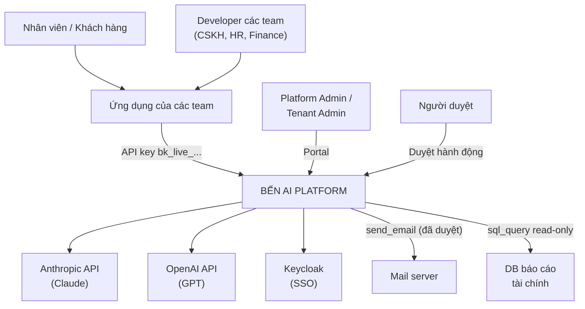

### 6.2 C4 cấp 2 — Container

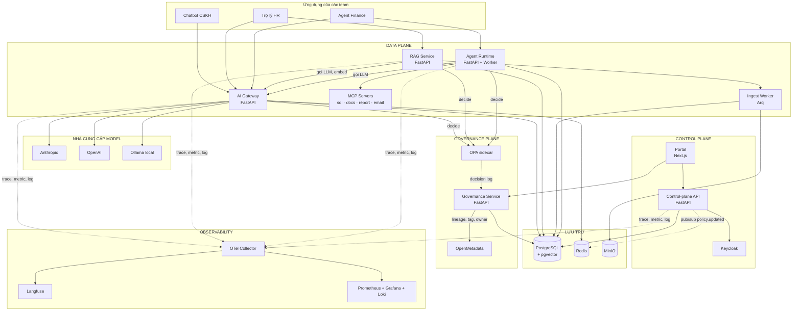

### 6.3 Data plane và control plane

| | Data plane | Control plane |
|---|---|---|
| Thành phần | Gateway, RAG, Agent, MCP | Portal, Control-plane API, Keycloak |
| Yêu cầu | Nhanh, stateless, scale ngang | Đúng, có audit, được phép chậm |
| Nếu sập | Ảnh hưởng trực tiếp tới người dùng | Không sửa được cấu hình, **nhưng request vẫn chạy** |
| Cấu hình | Đọc từ cache Redis + cache in-memory | Ghi vào Postgres, phát sự kiện |

**Nguyên tắc:** data plane không bao giờ gọi đồng bộ sang control plane trên đường đi của request.

### 6.4 Sáu nguyên tắc kiến trúc

1. **Một điểm vào, nhiều nhà cung cấp.** Chỉ gateway giữ key thật của provider.
2. **Mặc định từ chối.** Model, tài liệu, tool — phải được cấp quyền rõ ràng.
3. **Request nào cũng có trace và có giá.** Gắn `tenant_id`, `trace_id`, chi phí USD.
4. **Chất lượng là cổng deploy.** Đổi prompt, model, policy đều phải qua eval.
5. **Hỏng có chủ đích.** Provider sập → fallback. Guardrail lỗi → chặn với tenant nhạy cảm, cho qua kèm log với tenant thường.
6. **Dữ liệu mang nhãn đi theo nó.** Nhãn phân loại lan truyền từ nguồn → context → câu trả lời → báo cáo; nhãn cao nhất quyết định model và hành động được phép ([§27](#27-phân-loại-dữ-liệu)).

---

## 7. AI Gateway

> **Hiện thực theo [ADR-017](adr/017-litellm-proxy-as-gateway-core.md):** LiteLLM Proxy làm lõi, Bến mở rộng bằng plugin (không sửa mã nguồn LiteLLM). Thiết kế logic trong mục này giữ nguyên; ánh xạ sang hiện thực:
>
> | Bước logic | Hiện thực |
> |---|---|
> | auth, quota, ngân sách | Virtual key + team (= tenant) + budget/RPM/TPM của LiteLLM |
> | guard.input / guard.output | `BenPIIGuardrail` — hook `pre_call` / `post_call` / streaming |
> | governance.decide | `BenGovernanceGuardrail` — hook `pre_call`, đặt `disable_fallbacks` |
> | cache | Cache của LiteLLM — **tắt** cho đến ADR-007 |
> | router, fallback, adapter | Router và provider của LiteLLM |
> | metering | Callback `BenUsageLogger` → Redis Streams `stream:usage` |
> | Endpoint Anthropic | `/v1/messages` hợp nhất (không dùng passthrough `/anthropic` cho tenant có PII) |

### 7.1 Hai loại endpoint

| Loại | Đường dẫn | Dùng khi | Đặc điểm |
|---|---|---|---|
| **Thống nhất** | `/v1/chat/completions`, `/v1/embeddings` | Team muốn nền tảng tự chọn model, dễ đổi provider | Format OpenAI; `model: "auto"` hoặc `tier:small`; router hoạt động |
| **Passthrough Anthropic** | `/anthropic/v1/messages` | Team dùng Claude và cần tính năng gốc (prompt caching, thinking, citations, tool) | Giữ nguyên format; chỉ cho các model Claude được tenant cho phép |
| **Passthrough OpenAI** | `/openai/v1/chat/completions`, `/openai/v1/responses` | Team dùng tính năng riêng của OpenAI | Giữ nguyên format |

Cả ba loại **đều chạy qua chuỗi middleware** bên dưới. Passthrough chỉ bỏ qua bước router (vì model đã chỉ định) và bước chuẩn hoá format.

Gateway chấp nhận key của nền tảng ở cả `Authorization: Bearer` (kiểu OpenAI) và `x-api-key` (kiểu Anthropic), để SDK gốc chạy được mà không cần sửa.

### 7.2 Chuỗi middleware

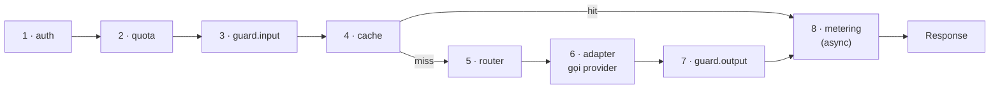

| # | Bước | Thời gian mục tiêu | Chi tiết |
|---|---|---|---|
| 1 | **auth** | ~4 ms | Key dạng `bk_live_<tenant>_<random>`. Chỉ lưu SHA-256. Cache kết quả xác thực trong Redis 60 s. Gắn `tenant_id`, `key_id`, `scopes` vào context |
| 2 | **quota** | ~2 ms | Token bucket trên Redis bằng Lua script (nguyên tử) theo cặp *tenant × tier*: RPM, TPM. Kiểm tra ngân sách **trước** khi gọi bằng chi phí ước tính = token vào × giá vào + `max_tokens` × giá ra. 80% → cảnh báo; 100% → chặn hoặc hạ tier |
| 3 | **guard.input** | ~16 ms | Che PII có đảo ngược; phát hiện prompt injection (heuristic + classifier nhỏ). Quét kỹ nhất nội dung không tin cậy (tài liệu RAG, output tool) |
| 4 | **cache** | ~10 ms | Exact cache: hash(prompt chuẩn hoá + model + tham số). Semantic cache (tuỳ tenant): cosine ≥ 0,95. Không cache khi có PII, `temperature` > 0,3, hoặc câu trả lời phụ thuộc người hỏi |
| 5 | **router** | ~2 ms | Chọn chuỗi model theo policy (§7.4); bỏ provider đang mở circuit breaker |
| 6 | **adapter** | — | Gọi provider; chuẩn hoá request/response; streaming SSE. Retry có backoff + jitter chỉ với 429/5xx và chỉ khi **chưa stream byte nào** về client |
| 7 | **guard.output** | ~14 ms | Khôi phục placeholder PII (nếu policy cho phép); kiểm tra PII mới; với RAG kiểm tra trích dẫn `[n]` có thật |
| 8 | **metering** | async | Phát usage event vào Redis Streams; worker gom lô ghi Postgres. Không làm chậm response |

**Overhead mục tiêu** = bước 1 + 2 + 3 + 4 + 5 + 7 ≈ 48 ms, cộng bước quyết định governance ~3 ms ([§26.4](#264-governance-gắn-vào-luồng-request)) ≈ 51 ms < 60 ms (NFR-1).

### 7.3 Che PII tiếng Việt

| Loại | Nhận diện | Placeholder |
|---|---|---|
| Số điện thoại | `(\+84|0)(3|5|7|8|9)\d{8}` sau khi bỏ khoảng trắng, dấu chấm | `<PHONE_n>` |
| CCCD | 12 chữ số, 3 số đầu là mã tỉnh hợp lệ | `<CCCD_n>` |
| Email | Presidio có sẵn | `<EMAIL_n>` |
| Số tài khoản | 8–19 chữ số đứng gần từ khoá "STK", "tài khoản", tên ngân hàng | `<BANK_n>` |
| Mã đơn hàng | Mẫu riêng của ShopViet `#[A-Z]\d{4,}` | `<ORDER_n>` |
| Họ tên | NER tiếng Việt + từ điển họ phổ biến (độ chính xác thấp hơn — ghi rõ hạn chế) | `<NAME_n>` |

Cách hoạt động:

```python
# Minh hoạ ý tưởng — không phải code hoàn chỉnh
redacted, mapping = pii.redact("SĐT 0912 345 678, đơn #A1293")
# redacted = "SĐT <PHONE_1>, đơn <ORDER_1>"
# mapping  = {"<PHONE_1>": "0912 345 678", "<ORDER_1>": "#A1293"}   ← chỉ nằm trong RAM của request

answer = call_provider(redacted)                 # provider chỉ thấy placeholder
final  = pii.restore(answer, mapping)            # nếu policy pii.restore = true
```

Chế độ theo tenant: `redact` (che rồi khôi phục), `mask` (che, không khôi phục), `block` (từ chối request có PII), `off`.

### 7.4 Router và policy

`policies/cskh.yaml`:

```yaml
tenant: cskh
budget:
  monthly_usd: 50
  on_soft_limit: notify            # 80%
  on_hard_limit: downgrade         # hạ về tier small thay vì chặn khách
data_residency: any                # tenant hr: local_only
allowed_models:                    # dùng cho cả endpoint passthrough
  - local/qwen2.5-7b
  - anthropic/claude-haiku-4-5
  - anthropic/claude-sonnet-5
  - openai/<model-nhỏ>
routes:
  - when: { task: faq, input_tokens_lt: 2000 }
    use: [local/qwen2.5-7b, anthropic/claude-haiku-4-5]
  - when: { task: complaint }
    use: [anthropic/claude-sonnet-5, openai/<model-nhỏ>]
  - default: true
    use: [anthropic/claude-haiku-4-5, local/qwen2.5-7b]
circuit_breaker: { error_rate: 0.5, window_s: 30, cooldown_s: 60 }
cache:
  exact: true
  semantic: { enabled: true, threshold: 0.95 }
guardrails:
  pii: redact
  pii_restore: true
  injection: block
  on_error: fail_open              # tenant hr: fail_closed
limits: { rpm: 600, tpm: 200000, max_tokens_cap: 4096 }
```

`policies/hr.yaml` (khác biệt chính):

```yaml
tenant: hr
data_residency: local_only         # router loại mọi model cloud
allowed_models: [local/qwen2.5-7b]
guardrails: { pii: redact, injection: block, on_error: fail_closed }
cache: { exact: true, semantic: { enabled: false } }
```

Thuật toán chọn model:

```
1. Lọc allowed_models theo data_residency
2. Tìm route đầu tiên khớp điều kiện `when` (task, độ dài input...)
3. Lấy danh sách `use`, bỏ model mà provider đang mở circuit breaker
4. Nếu ngân sách ≥ 100% và on_hard_limit = downgrade → giữ lại model tier thấp nhất
5. Thử lần lượt; lỗi có thể retry thì chuyển model kế tiếp; gắn header X-Ben-Fallback
```

### 7.5 Model catalog

`config/model_catalog.yaml` — nguồn duy nhất để tính tiền.

```yaml
# Giá USD / 1 triệu token. KIỂM TRA LẠI bảng giá chính thức trước khi benchmark.
# Giá Anthropic lấy theo bảng giá first-party tại thời điểm viết (06/2026).
- id: anthropic/claude-opus-5
  provider: anthropic
  tier: large
  price_in: 5.00
  price_out: 25.00
  cache_read_multiplier: 0.1       # xác minh với tài liệu prompt caching
  cache_write_multiplier: 1.25     # xác minh
  residency: cloud
- id: anthropic/claude-sonnet-5
  provider: anthropic
  tier: medium
  price_in: 2.00
  price_out: 10.00
  residency: cloud
- id: anthropic/claude-haiku-4-5
  provider: anthropic
  tier: small
  price_in: 1.00
  price_out: 5.00
  residency: cloud
- id: openai/<model-nhỏ>
  provider: openai
  tier: small
  price_in: <điền theo bảng giá OpenAI>
  price_out: <điền>
  residency: cloud
- id: local/qwen2.5-7b
  provider: ollama
  tier: small
  price_in: 0
  price_out: 0
  residency: local
```

### 7.6 Metering — mỗi provider tính một kiểu

Đây là chỗ dễ sai nhất. Hai provider trả usage khác nhau:

| | Anthropic Messages API | OpenAI Chat Completions |
|---|---|---|
| Token vào thường | `input_tokens` (**không** gồm token cache) | `prompt_tokens` (**đã gồm** token cache) |
| Token đọc từ cache | `cache_read_input_tokens` | `prompt_tokens_details.cached_tokens` |
| Token ghi cache | `cache_creation_input_tokens` | — |
| Token ra | `output_tokens` (gồm cả token thinking) | `completion_tokens` |
| Khi streaming | usage nằm trong event `message_start` và `message_delta` | phải gửi `stream_options: {include_usage: true}` |

```python
# Minh hoạ: chuẩn hoá về một cấu trúc chung
@dataclass
class Usage:
    input: int
    output: int
    cache_read: int = 0
    cache_write: int = 0

def usage_from_anthropic(u: dict) -> Usage:
    return Usage(
        input=u["input_tokens"],
        output=u["output_tokens"],
        cache_read=u.get("cache_read_input_tokens") or 0,
        cache_write=u.get("cache_creation_input_tokens") or 0,
    )

def usage_from_openai_chat(u: dict) -> Usage:
    cached = (u.get("prompt_tokens_details") or {}).get("cached_tokens", 0)
    return Usage(input=u["prompt_tokens"] - cached, output=u["completion_tokens"], cache_read=cached)

def cost_usd(usage: Usage, m: ModelEntry) -> float:
    return (
        usage.input * m.price_in
        + usage.cache_read * m.price_in * m.cache_read_multiplier
        + usage.cache_write * m.price_in * m.cache_write_multiplier
        + usage.output * m.price_out
    ) / 1_000_000
```

Test bắt buộc: đối chiếu tổng chi phí tính được với usage mà provider báo trên console (NFR-9).

### 7.7 Adapter

```python
# Minh hoạ interface
class ProviderAdapter(Protocol):
    name: str
    async def chat(self, req: UnifiedChatRequest) -> UnifiedChatResponse: ...
    async def chat_stream(self, req: UnifiedChatRequest) -> AsyncIterator[UnifiedChunk]: ...
    async def passthrough(self, raw: Request) -> StreamingResponse: ...
    def parse_usage(self, payload: dict) -> Usage: ...
    def is_retryable(self, error: Exception) -> bool: ...
```

- `AnthropicAdapter`, `OpenAIAdapter` dùng **SDK chính thức** cho endpoint thống nhất.
- Endpoint passthrough chuyển tiếp nguyên byte bằng `httpx` (vì gateway là proxy), thay header xác thực bằng key thật của nền tảng, và **đọc usage từ response/stream** để metering.
- `OllamaAdapter` gọi Ollama local.
- `MockAdapter` trả lời cố định với độ trễ cấu hình được — dùng cho load test và chaos test.
- Với Claude, adapter phải kiểm tra `stop_reason` trước khi đọc nội dung (ví dụ trường hợp `refusal`) và ghi lý do dừng vào trace.

### 7.8 Response header

```
X-Ben-Model: anthropic/claude-sonnet-5
X-Ben-Route: complaint → [anthropic/claude-sonnet-5, openai/<model-nhỏ>]
X-Ben-Fallback: false
X-Ben-Cache: miss
X-Ben-PII-Redacted: PHONE=1, ORDER_ID=1
X-Ben-Cost-USD: 0.004120
X-Ben-Trace-Id: 4bf92f3577b34da6a3ce929d0e0e4736
X-RateLimit-Remaining-Requests: 598
X-RateLimit-Remaining-Tokens: 48210
X-Ben-Budget-Used: 0.62
```

---

## 8. RAG-as-a-Service

### 8.1 Ingest

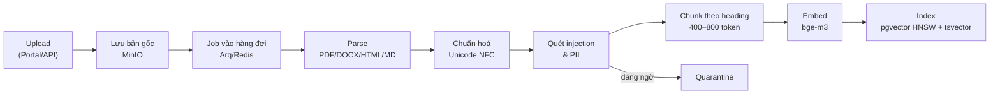

| Bước | Quyết định |
|---|---|
| Parse | Docling hoặc Unstructured; giữ cấu trúc heading, bảng |
| Chuẩn hoá | **Unicode NFC** — tiếng Việt có hai cách mã hoá dấu, không chuẩn hoá thì tìm kiếm trượt |
| Quét | Chunk chứa dấu hiệu injection → `quarantined = true`, không bao giờ vào context |
| Chunk | Theo heading; 400–800 token; overlap 15%; lưu đường dẫn heading, ví dụ "Chính sách vận chuyển › Nội thành › Thời gian giao" |
| Embed | `bge-m3` (1024 chiều, đa ngôn ngữ), chạy local |
| Index | HNSW cho vector; GIN cho `tsvector`; copy `tenant_id` và `acl_groups` xuống từng chunk |

Trạng thái tài liệu: `uploaded → parsing → indexing → ready` hoặc `failed` / `partially_quarantined`.

Cập nhật tài liệu = version mới; chunk version cũ bị xoá khi version mới `ready`. Xoá tài liệu → xoá file gốc, chunk và mục cache liên quan (NFR-13).

### 8.2 Truy vấn

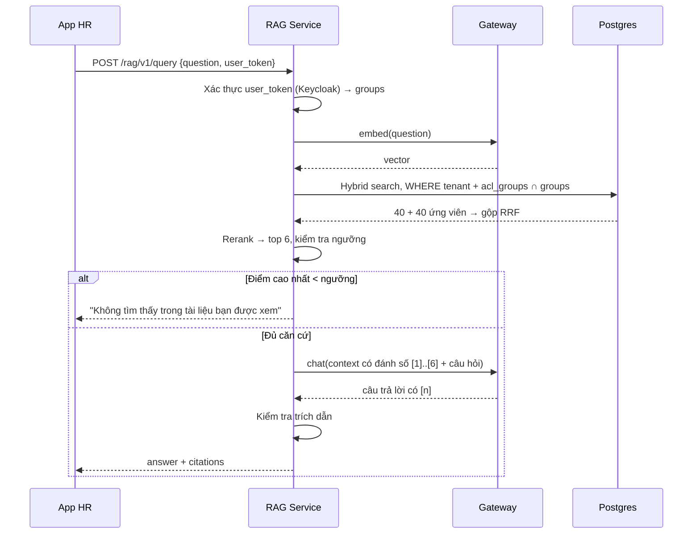

Câu SQL lõi (rút gọn):

```sql
-- Nhánh vector
SELECT id, 1 - (embedding <=> :qvec) AS score
FROM chunks
WHERE tenant_id = :tenant
  AND acl_groups && :user_groups        -- lọc quyền TRƯỚC
  AND NOT quarantined
ORDER BY embedding <=> :qvec
LIMIT 40;

-- Nhánh từ khoá
SELECT id, ts_rank(tsv, plainto_tsquery('simple', :q)) AS score
FROM chunks
WHERE tenant_id = :tenant
  AND acl_groups && :user_groups
  AND NOT quarantined
  AND tsv @@ plainto_tsquery('simple', :q)
ORDER BY score DESC
LIMIT 40;
-- Hai danh sách gộp bằng Reciprocal Rank Fusion ở tầng ứng dụng
```

Lớp phòng thủ thứ hai — Row Level Security:

```sql
ALTER TABLE chunks ENABLE ROW LEVEL SECURITY;
CREATE POLICY tenant_isolation ON chunks
  USING (tenant_id = current_setting('app.tenant_id')::uuid);
```

### 8.3 Response

```json
{
  "answer": "Thưởng Tết phòng Kinh doanh gồm lương tháng 13 và thưởng theo doanh số quý 4 [1]. Mức thưởng doanh số tính theo bậc vượt chỉ tiêu [2].",
  "citations": [
    { "n": 1, "document": "Quy chế thưởng — Phòng Kinh doanh.docx", "section": "Điều 3 › Thưởng Tết", "chunk_id": "ck_8f2..." },
    { "n": 2, "document": "Quy chế thưởng — Phòng Kinh doanh.docx", "section": "Phụ lục 1 › Bậc thưởng", "chunk_id": "ck_91a..." }
  ],
  "grounded": true,
  "trace_id": "7a1c..."
}
```

### 8.4 Chỉ số chất lượng

| Tầng | Chỉ số | Mục tiêu MVP |
|---|---|---|
| Retrieval | recall@6 trên golden set | ≥ 0,85 |
| Retrieval | MRR | ≥ 0,70 |
| Trả lời | Faithfulness (bám tài liệu) | ≥ 0,90 |
| Trả lời | Tỉ lệ trích dẫn đúng | ≥ 0,95 |
| Trả lời | Từ chối đúng khi không có đáp án | ≥ 0,90 |
| Bảo mật | Rò rỉ ngoài quyền | 0 |

---

## 9. Agent Runtime

### 9.1 Định nghĩa agent

`agents/finance-analyst.yaml`:

```yaml
name: finance-analyst
tenant: finance
description: Phân tích doanh thu, viết báo cáo, gửi cho ban giám đốc
prompt: finance-analyst@production      # lấy từ prompt registry
model: auto
tools: [sql_query, search_docs, create_report, send_email]
limits:
  max_steps: 12
  max_cost_usd: 0.20
  timeout_s: 600
loop_guard:
  same_call_repeat: 3                   # cùng tool + cùng tham số lặp 3 lần → dừng
approval:
  notify: portal                        # mở rộng: slack webhook
  expires_after_h: 24
```

### 9.2 Vòng đời một lượt chạy

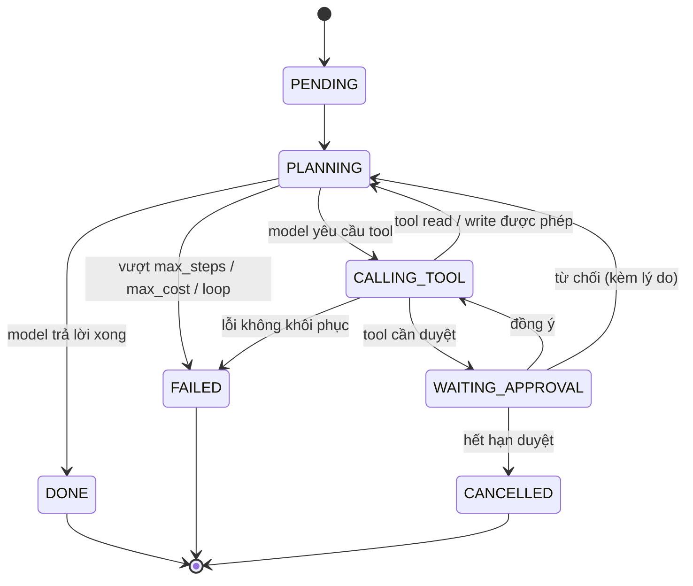

- Mỗi lần chuyển trạng thái được **ghi Postgres trong transaction** → worker chết thì worker khác nhận tiếp từ bước cuối.
- Client gọi `POST /agent/v1/runs` → nhận `run_id` → nghe SSE `GET /agent/v1/runs/{id}/events` hoặc poll.

### 9.3 Tool registry

| Tool | Mức rủi ro | Cần duyệt | Kiểm soát |
|---|---|---|---|
| `sql_query` | read | Không | DB user chỉ SELECT trên schema `reporting`; `statement_timeout = 5s`; tối đa 1.000 dòng; chặn câu có nhiều statement |
| `search_docs` | read | Không | Gọi RAG **bằng danh tính người khởi chạy agent**, không phải quyền của agent |
| `create_report` | write | Chỉ khi ghi đè | Chỉ ghi vào bucket của tenant |
| `send_email` | external | **Luôn luôn** | Chỉ tới domain `@shopviet.vn`; demo dùng MailHog |

Đăng ký tool mới: Tenant Admin khai báo MCP server → Platform Admin xem schema và mức rủi ro → duyệt → tool xuất hiện trong danh sách cho agent.

### 9.4 Bảo vệ

- **Output của tool là dữ liệu không đáng tin** → quét injection trước khi đưa lại cho model; bọc trong delimiter rõ ràng.
- **Sandbox:** mỗi MCP server là container riêng, không có mạng ra ngoài trừ danh sách cho phép.
- **Budget guard:** cộng dồn chi phí từ metering; vượt `max_cost_usd` → dừng.
- **Audit từng bước:** tool, tham số, kết quả (đã che PII), ai duyệt, lúc nào, lý do.

---

## 10. Observability & Evaluation

### 10.1 Ba tín hiệu

| Tín hiệu | Công cụ | Nội dung |
|---|---|---|
| Trace | OpenTelemetry → OTel Collector → Langfuse (+ Tempo tuỳ chọn) | Span cho từng bước middleware, retrieval, lời gọi model, tool. Thuộc tính theo GenAI semantic conventions: `gen_ai.request.model`, `gen_ai.usage.input_tokens`, `gen_ai.usage.output_tokens` + thuộc tính riêng `ben.tenant_id`, `ben.cost_usd` |
| Metric | Prometheus → Grafana | `ben_requests_total`, `ben_request_duration_seconds`, `ben_tokens_total`, `ben_cost_usd_total`, `ben_cache_hits_total`, `ben_fallback_total`, `ben_guardrail_blocks_total`, `ben_circuit_state` |
| Log | Loki | JSON có cấu trúc, luôn có `trace_id`; **không bao giờ log prompt thô chưa che PII** |

### 10.2 Ví dụ một trace

Khiếu nại của khách qua chatbot CSKH, có RAG (số minh hoạ):

```
TRACE 4bf92f35…   tenant=cskh   model=anthropic/claude-sonnet-5   tổng 1.684 ms   TTFT 914 ms
│
├─ gateway.auth              0 ms ▏                                             4 ms
├─ quota.check               4 ms ▏                                             2 ms
├─ guard.input               6 ms ▏                                            16 ms
├─ cache.lookup             22 ms ▏                                            10 ms  (miss)
├─ rag.retrieve             32 ms ███████                                     260 ms
│   ├─ embed.query          32 ms █                                            36 ms
│   ├─ search.hybrid+acl    68 ms █                                            40 ms
│   └─ rerank              108 ms █████                                       184 ms
├─ router.select           292 ms ▏                                             2 ms
├─ llm.generate            294 ms ██████████████████████████████████████    1.376 ms
├─ guard.output          1.670 ms ▏                                            14 ms
└─ metering.emit         1.684 ms ▏ (async)                                     6 ms

Overhead nền tảng = 4 + 2 + 16 + 10 + 2 + 14 = 48 ms   → đạt NFR-1
Nhận xét: rerank chiếm 70% thời gian retrieval → ứng viên tối ưu đầu tiên
```

### 10.3 Dashboard & cảnh báo

| Dashboard | Cảnh báo |
|---|---|
| Chi phí theo tenant / ngày / model | Tenant tiêu > 50% ngân sách tháng trong 1 ngày |
| p50/p95 latency và TTFT theo model | Lỗi của một provider > 5% trong 5 phút |
| Tỉ lệ cache hit, fallback | p95 gateway vượt SLO liên tục 10 phút |
| Guardrail chặn theo loại | Một API key tăng lưu lượng gấp 10 lần bình thường |
| Đường tiêu ngân sách tháng | Hàng chờ duyệt có yêu cầu quá 4 giờ |

### 10.4 Eval như unit test

```
evals/
├── cskh/
│   ├── golden.jsonl          # 150 mẫu
│   └── eval.yaml             # chỉ số + ngưỡng
├── hr/
│   ├── golden.jsonl          # 80 mẫu, gồm câu hỏi ngoài quyền
│   └── eval.yaml
└── pii/
    └── vn_pii_500.jsonl      # bộ test PII
```

Một mẫu trong `golden.jsonl`:

```json
{"id": "cskh-042", "input": "Mua hôm 1/9 giờ muốn đổi size được không?", "metadata": {"task": "faq"}, "expected": "Được đổi trong 7 ngày kể từ khi nhận hàng, sản phẩm còn tem mác", "must_cite": ["Chính sách đổi trả v3"], "tags": ["doi-tra"]}
```

`eval.yaml`:

```yaml
metrics:
  correctness:   { judge: llm, threshold: 0.85 }
  faithfulness:  { judge: llm, threshold: 0.90 }
  citation_ok:   { judge: rule, threshold: 0.95 }
  pii_leak:      { judge: rule, max: 0 }
  cost_per_100:  { report_only: true }
judge:
  model: <model khác model đang được đánh giá>
  calibration_set: human_labeled_50.jsonl
```

Luồng trong CI:

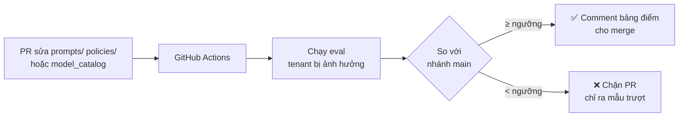

**Online eval:** lấy mẫu 5% traffic thật, chấm điểm bất đồng bộ, vẽ xu hướng theo tuần.

**Prompt registry:** prompt có version; mỗi version gắn điểm eval; deploy = chuyển nhãn `production`; rollback = chuyển nhãn về version cũ.

---

## 11. Control plane & Portal

### 11.1 Màn hình

| Màn hình | Chức năng | Ai dùng |
|---|---|---|
| Tổng quan | Chi phí, request, lỗi toàn công ty và từng tenant | Platform Admin |
| Tenants | Tạo, tạm khoá tenant; ngân sách; data residency | Platform Admin |
| Model catalog | Model được phép, giá, tier | Platform Admin |
| API keys | Tạo, xoay vòng, thu hồi; key hiện một lần | Tenant Admin |
| Policies | Soạn YAML, validate, diff giữa version | Tenant Admin |
| Tài liệu | Upload, gán nhóm quyền, trạng thái ingest, quarantine | Tenant Admin |
| Prompts | Version, điểm eval, chuyển nhãn | Tenant Admin |
| Agents & Tools | Định nghĩa agent, đăng ký MCP server | Tenant Admin, Platform Admin |
| Duyệt | Hàng chờ duyệt hành động agent | Người duyệt |
| Traces | Tìm theo trace_id, tenant, thời gian (link sang Langfuse) | Mọi admin |
| Audit log | Lọc theo người, hành động, tài nguyên; xuất CSV | Security |
| Phân loại | Hàng chờ xác nhận nhãn, lịch sử đổi nhãn, yêu cầu hạ nhãn | Data Owner, Data Steward |
| AI Registry | Đăng ký use case, phân tầng rủi ro, phê duyệt, xuất DPIA/ROPA | Tenant Admin, DPO |
| Yêu cầu chủ thể dữ liệu | Tạo, duyệt, theo dõi, tải báo cáo bằng chứng; legal hold | DPO |
| Governance dashboard | KPI ở §33.3, vấn đề chất lượng dữ liệu | DPO, Platform Admin |

### 11.2 Đồng bộ cấu hình

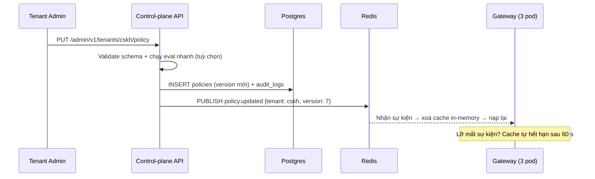

### 11.3 Phân quyền (RBAC)

| Quyền | Platform Admin | Tenant Admin | Người duyệt | Security | Developer |
|---|:-:|:-:|:-:|:-:|:-:|
| Tạo/khoá tenant | ✅ | | | | |
| Sửa model catalog | ✅ | | | | |
| Tạo/thu hồi key của tenant mình | ✅ | ✅ | | | |
| Sửa policy của tenant mình | ✅ | ✅ | | | |
| Upload tài liệu, gán quyền | | ✅ | | | |
| Duyệt tool mới | ✅ | | | | |
| Duyệt hành động agent | | | ✅ | | |
| Xem audit log | ✅ | tenant mình | | ✅ | |
| Gọi API bằng key | | | | | ✅ |

---

## 12. Chống shadow AI: ba lớp kiểm soát

Gateway **chỉ kiểm soát được request đi qua nó**. Để không ai lách được, cần ba lớp:

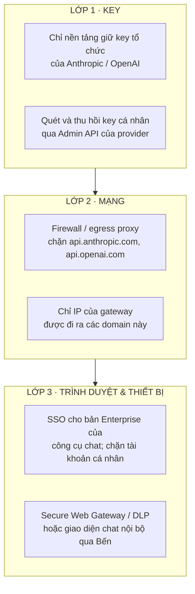

| Cách lách | Gateway bắt được? | Lớp chặn |
|---|---|---|
| Team tự tạo key rồi gọi thẳng provider | ❌ | Lớp 1 + Lớp 2 |
| Server gọi thẳng `api.openai.com` | ❌ | Lớp 2 |
| Dán dữ liệu vào web chat (chatgpt.com, claude.ai) | ❌ không phải API | Lớp 3 |
| Công cụ lập trình (Claude Code, Cursor...) | ✅ nếu công cụ cho đổi base URL — ví dụ Claude Code hỗ trợ `ANTHROPIC_BASE_URL` | Cấu hình tập trung trên máy nhân viên |
| Gọi Claude/GPT qua Bedrock, Vertex, Azure | ⚠️ | Đưa các nền tảng này thành provider phía sau gateway; khoá IAM gọi trực tiếp |

**Không** dùng giải mã TLS (MITM) để soi traffic: rủi ro bảo mật, dễ làm hỏng SDK. Explicit proxy + chặn egress sạch hơn.

**Trong phạm vi dự án:**
- Hiện thực **Lớp 1** (nền tảng giữ key) và **Lớp 2** (Docker network: container app nằm trong network `internal: true`, không có đường ra internet; chỉ gateway nằm thêm network có egress).
- **Lớp 3** chỉ mô tả trong tài liệu (ADR-012).

```yaml
# deploy/compose/docker-compose.yml (trích)
networks:
  apps_internal:
    internal: true          # container trong network này KHÔNG ra được internet
  egress:
    driver: bridge

services:
  gateway:
    networks: [apps_internal, egress]   # duy nhất có đường ra ngoài
  demo-cskh:
    networks: [apps_internal]           # gọi thẳng api.openai.com → thất bại
```

---

## 13. Đặc tả API

### 13.1 Gateway

| Method | Đường dẫn | Mô tả |
|---|---|---|
| POST | `/v1/chat/completions` | API thống nhất, format OpenAI, `model: "auto"` |
| POST | `/v1/embeddings` | Embedding |
| GET | `/v1/models` | Model tenant được dùng |
| POST | `/anthropic/v1/messages` | Passthrough Anthropic Messages API |
| POST | `/anthropic/v1/messages/count_tokens` | Passthrough đếm token |
| POST | `/openai/v1/chat/completions` | Passthrough OpenAI |
| POST | `/openai/v1/responses` | Passthrough OpenAI Responses |
| GET | `/healthz`, `/readyz` | Health check |

### 13.2 RAG

| Method | Đường dẫn | Mô tả |
|---|---|---|
| POST | `/rag/v1/collections` | Tạo collection trong tenant |
| POST | `/rag/v1/collections/{id}/documents` | Upload (multipart) + `acl_groups` |
| GET | `/rag/v1/documents/{id}` | Trạng thái ingest |
| DELETE | `/rag/v1/documents/{id}` | Xoá hoàn toàn |
| POST | `/rag/v1/query` | Hỏi đáp có trích dẫn |
| POST | `/rag/v1/search` | Chỉ tìm kiếm, không sinh câu trả lời |

### 13.3 Agent

| Method | Đường dẫn | Mô tả |
|---|---|---|
| POST | `/agent/v1/runs` | Tạo lượt chạy `{agent, input}` |
| GET | `/agent/v1/runs/{id}` | Trạng thái + các bước |
| GET | `/agent/v1/runs/{id}/events` | SSE stream sự kiện |
| POST | `/agent/v1/runs/{id}/cancel` | Huỷ |
| GET | `/agent/v1/approvals?status=pending` | Hàng chờ duyệt |
| POST | `/agent/v1/approvals/{id}` | `{decision: approve/reject, reason}` |

### 13.4 Control plane

| Method | Đường dẫn | Mô tả |
|---|---|---|
| POST/GET | `/admin/v1/tenants` | Tenant |
| POST/DELETE | `/admin/v1/tenants/{t}/keys` | API key |
| GET/PUT | `/admin/v1/tenants/{t}/policy` | Policy (mỗi PUT là version mới) |
| GET | `/admin/v1/tenants/{t}/usage?from=&to=&group_by=` | Usage & chi phí |
| GET/PUT | `/admin/v1/models` | Model catalog |
| POST | `/admin/v1/prompts/{name}/versions` | Prompt version mới |
| POST | `/admin/v1/prompts/{name}/labels` | Chuyển nhãn production |
| POST | `/admin/v1/tools` | Đăng ký MCP tool |
| GET | `/admin/v1/audit` | Audit log |

### 13.5 Mã lỗi

Mọi lỗi trả về cùng một dạng, có hướng dẫn sửa:

```json
{
  "error": {
    "type": "budget_exceeded",
    "message": "Tenant cskh đã dùng 100% ngân sách tháng 09/2026 (50 USD). Policy không cho phép hạ tier. Liên hệ Tenant Admin để tăng ngân sách.",
    "trace_id": "4bf92f35..."
  }
}
```

| HTTP | `type` | Khi nào |
|---|---|---|
| 401 | `invalid_api_key` | Key sai, hết hạn, bị thu hồi |
| 403 | `model_not_allowed` | Model ngoài `allowed_models` hoặc vi phạm data residency |
| 403 | `pii_blocked` | Policy `pii: block` và request có PII |
| 400 | `prompt_injection_detected` | Guard phát hiện injection |
| 429 | `rate_limited` | Vượt RPM/TPM — kèm `Retry-After` |
| 429 | `budget_exceeded` | Hết ngân sách, không hạ tier được |
| 502 | `upstream_error` | Mọi model trong chuỗi fallback đều lỗi |
| 503 | `guardrail_unavailable` | Guardrail lỗi và tenant `fail_closed` |
| 403 | `policy_denied` | OPA từ chối, kèm lý do (ví dụ `external_purpose_with_confidential`) |
| 403 | `usecase_not_approved` | Key live gắn với use case chưa được phê duyệt |
| 403 | `subject_restricted` | Request chứa định danh của người đã yêu cầu hạn chế xử lý |
| 503 | `policy_unavailable` | Không lấy được quyết định policy cho dữ liệu ≥ Confidential |

---

## 14. Mô hình dữ liệu

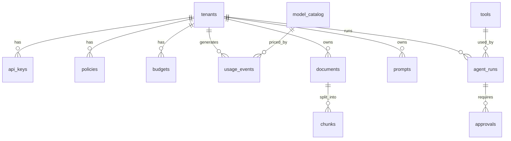

DDL rút gọn:

```sql
CREATE EXTENSION IF NOT EXISTS vector;

CREATE TABLE tenants (
  id              uuid PRIMARY KEY DEFAULT gen_random_uuid(),
  slug            text UNIQUE NOT NULL,             -- cskh, hr, finance
  data_residency  text NOT NULL DEFAULT 'any',      -- any | local_only
  status          text NOT NULL DEFAULT 'active',
  created_at      timestamptz NOT NULL DEFAULT now()
);

CREATE TABLE api_keys (
  id          uuid PRIMARY KEY DEFAULT gen_random_uuid(),
  tenant_id   uuid NOT NULL REFERENCES tenants(id),
  prefix      text NOT NULL,                        -- bk_live_cskh_7f3a (để hiển thị)
  key_hash    bytea NOT NULL UNIQUE,                -- SHA-256, không lưu key gốc
  scopes      text[] NOT NULL DEFAULT '{chat,embeddings}',
  expires_at  timestamptz,
  revoked_at  timestamptz,
  created_by  text NOT NULL,
  created_at  timestamptz NOT NULL DEFAULT now()
);

CREATE TABLE policies (
  id          bigserial PRIMARY KEY,
  tenant_id   uuid NOT NULL REFERENCES tenants(id),
  version     int NOT NULL,
  spec        jsonb NOT NULL,
  created_by  text NOT NULL,
  created_at  timestamptz NOT NULL DEFAULT now(),
  UNIQUE (tenant_id, version)
);

CREATE TABLE model_catalog (
  id                      text PRIMARY KEY,         -- anthropic/claude-sonnet-5
  provider                text NOT NULL,
  tier                    text NOT NULL,
  price_in                numeric(10,4) NOT NULL,   -- USD / 1M token
  price_out               numeric(10,4) NOT NULL,
  cache_read_multiplier   numeric(5,3),
  cache_write_multiplier  numeric(5,3),
  residency               text NOT NULL,
  enabled                 boolean NOT NULL DEFAULT true
);

CREATE TABLE budgets (
  tenant_id   uuid REFERENCES tenants(id),
  month       date,
  limit_usd   numeric(12,4) NOT NULL,
  spent_usd   numeric(12,6) NOT NULL DEFAULT 0,     -- giá trị nóng nằm ở Redis
  PRIMARY KEY (tenant_id, month)
);

CREATE TABLE usage_events (
  ts            timestamptz NOT NULL,
  tenant_id     uuid NOT NULL,
  key_id        uuid,
  endpoint      text NOT NULL,                      -- unified | anthropic | openai | rag | agent
  model         text NOT NULL,
  tokens_in     int NOT NULL,
  tokens_out    int NOT NULL,
  cache_read    int NOT NULL DEFAULT 0,
  cache_write   int NOT NULL DEFAULT 0,
  cost_usd      numeric(12,6) NOT NULL,
  latency_ms    int NOT NULL,
  cache_hit     boolean NOT NULL DEFAULT false,
  fallback      boolean NOT NULL DEFAULT false,
  status        smallint NOT NULL,
  trace_id      text NOT NULL
) PARTITION BY RANGE (ts);                          -- partition theo tháng

CREATE TABLE documents (
  id            uuid PRIMARY KEY DEFAULT gen_random_uuid(),
  tenant_id     uuid NOT NULL REFERENCES tenants(id),
  collection    text NOT NULL,
  title         text NOT NULL,
  source_uri    text NOT NULL,                      -- s3://ben-docs/...
  version       int NOT NULL DEFAULT 1,
  acl_groups    text[] NOT NULL,
  status        text NOT NULL,                      -- uploaded|parsing|indexing|ready|failed
  created_at    timestamptz NOT NULL DEFAULT now()
);

CREATE TABLE chunks (
  id            uuid PRIMARY KEY DEFAULT gen_random_uuid(),
  document_id   uuid NOT NULL REFERENCES documents(id) ON DELETE CASCADE,
  tenant_id     uuid NOT NULL,
  heading_path  text,
  content       text NOT NULL,
  embedding     vector(1024) NOT NULL,
  tsv           tsvector GENERATED ALWAYS AS (to_tsvector('simple', content)) STORED,
  acl_groups    text[] NOT NULL,
  quarantined   boolean NOT NULL DEFAULT false
);
CREATE INDEX ON chunks USING hnsw (embedding vector_cosine_ops);
CREATE INDEX ON chunks USING gin (tsv);
CREATE INDEX ON chunks USING gin (acl_groups);
CREATE INDEX ON chunks (tenant_id);

CREATE TABLE prompts (
  id          bigserial PRIMARY KEY,
  tenant_id   uuid NOT NULL REFERENCES tenants(id),
  name        text NOT NULL,
  version     int NOT NULL,
  template    text NOT NULL,
  eval_score  jsonb,
  labels      text[] NOT NULL DEFAULT '{}',
  UNIQUE (tenant_id, name, version)
);

CREATE TABLE tools (
  id            text PRIMARY KEY,                   -- send_email
  mcp_url       text NOT NULL,
  risk_level    text NOT NULL,                      -- read | write | external
  input_schema  jsonb NOT NULL,
  approved_by   text,
  approved_at   timestamptz
);

CREATE TABLE agent_runs (
  id          uuid PRIMARY KEY DEFAULT gen_random_uuid(),
  tenant_id   uuid NOT NULL,
  agent       text NOT NULL,
  state       text NOT NULL,
  input       jsonb NOT NULL,
  steps       jsonb NOT NULL DEFAULT '[]',
  cost_usd    numeric(12,6) NOT NULL DEFAULT 0,
  started_by  text NOT NULL,
  updated_at  timestamptz NOT NULL DEFAULT now()
);

CREATE TABLE approvals (
  id            uuid PRIMARY KEY DEFAULT gen_random_uuid(),
  run_id        uuid NOT NULL REFERENCES agent_runs(id),
  step          int NOT NULL,
  tool          text NOT NULL,
  arguments     jsonb NOT NULL,
  requested_at  timestamptz NOT NULL DEFAULT now(),
  decided_by    text,
  decision      text,                               -- approved | rejected | expired
  reason        text
);

CREATE TABLE audit_logs (
  id        bigserial PRIMARY KEY,
  ts        timestamptz NOT NULL DEFAULT now(),
  actor     text NOT NULL,
  action    text NOT NULL,                          -- key.create, policy.update, approval.decide...
  resource  text NOT NULL,
  detail    jsonb NOT NULL
);
REVOKE UPDATE, DELETE ON audit_logs FROM ben_app;   -- chỉ được ghi thêm
```

**Redis keys:**

| Key | Kiểu | Dùng cho |
|---|---|---|
| `auth:{key_hash}` | hash, TTL 60 s | Cache xác thực |
| `rl:{tenant}:{tier}:rpm` / `:tpm` | token bucket | Rate limit |
| `budget:{tenant}:{yyyymm}` | float | Chi phí nóng trong tháng |
| `policy:{tenant}` | JSON, TTL 60 s | Cache policy |
| `cache:exact:{hash}` | string, TTL cấu hình | Exact cache |
| `cb:{provider}` | hash | Trạng thái circuit breaker |
| `stream:usage` | Stream | Usage event chờ ghi |
| `channel:policy.updated` | pub/sub | Đồng bộ cấu hình |

---

## 15. Bảo mật

### 15.1 Đối chiếu OWASP Top 10 for LLM Applications (2025)

| Rủi ro | Kiểm soát |
|---|---|
| **LLM01** Prompt Injection | Quét ở ingest và runtime; bọc nội dung không tin cậy bằng delimiter; quarantine; agent không tự làm hành động external |
| **LLM02** Sensitive Information Disclosure | Che PII có đảo ngược; `local_only`; guard đầu ra; ACL trong SQL; không log prompt thô |
| **LLM03** Supply Chain | Pin version image, model, thư viện; quét dependency trong CI; MCP server phải được duyệt |
| **LLM04** Data and Model Poisoning | Chỉ Tenant Admin được upload; version tài liệu; quarantine |
| **LLM05** Improper Output Handling | Output model không bao giờ chạy thẳng thành SQL/shell; tool có schema kiểm tra tham số |
| **LLM06** Excessive Agency | Mức rủi ro tool; người duyệt; DB user read-only; giới hạn bước và chi phí |
| **LLM07** System Prompt Leakage | Không đặt bí mật trong prompt; phát hiện system prompt xuất hiện ở output |
| **LLM08** Vector and Embedding Weaknesses | Tách tenant, RLS, ACL copy xuống chunk |
| **LLM09** Misinformation | Bắt buộc trích dẫn; từ chối khi thiếu căn cứ; eval faithfulness |
| **LLM10** Unbounded Consumption | RPM/TPM, ngân sách, `max_tokens_cap`, timeout, giới hạn agent |

### 15.2 STRIDE cho Gateway (ví dụ)

| Mối đe doạ | Tình huống | Kiểm soát |
|---|---|---|
| **S**poofing | Dùng key của tenant khác | Key ngẫu nhiên 256 bit, hash, thu hồi tức thì, cảnh báo bất thường |
| **T**ampering | Sửa header `X-Tenant` để đổi tenant | Tenant chỉ lấy từ key, bỏ qua mọi header tự khai |
| **R**epudiation | Chối đã đổi policy | Audit log chỉ ghi thêm |
| **I**nformation disclosure | PII ra provider; log chứa PII | Guard; log chỉ ghi bản đã che |
| **D**enial of service | Một tenant làm nghẽn cả hệ thống | Rate limit theo tenant; bulkhead theo provider |
| **E**levation of privilege | Developer tự nâng quyền qua API admin | Admin API chỉ nhận JWT Keycloak có role, không nhận API key |

### 15.3 Quản lý bí mật

- Key thật của provider: dev dùng `.env` (không commit, có `.env.example`); môi trường K8s dùng Kubernetes Secret (mở rộng: Vault / SOPS).
- Xoay vòng key provider không cần restart: gateway đọc lại secret theo chu kỳ.
- TLS giữa các service trong K8s (mở rộng: service mesh).

---

## 16. Quyết định kiến trúc (ADR)

Mỗi ADR là một file trong `docs/adr/`. Mẫu:

```markdown
# ADR-003: Chọn pgvector làm vector store

- Trạng thái: Đã chấp nhận
- Ngày: 2026-09-20

## Bối cảnh
Cần lưu ~1 triệu chunk, lọc theo tenant và nhóm quyền, cập nhật cùng metadata.

## Các phương án
1. pgvector trong Postgres sẵn có
2. Qdrant
3. OpenSearch

## Quyết định
Chọn pgvector.

## Lý do
- Một hệ thống thay vì hai; RLS dùng cho ACL; transaction chung với metadata.
- Quy mô mục tiêu (1 triệu vector) nằm trong vùng pgvector xử lý tốt.

## Hệ quả
- (+) Vận hành đơn giản, backup một nơi.
- (−) Trên ~10 triệu vector hoặc cần filter phức tạp tốc độ cao sẽ phải xem lại.
- Kiểm chứng bằng benchmark NFR-2 ở tuần 15.
```

### Danh sách ADR

| ADR | Câu hỏi | Quyết định | Đánh đổi chấp nhận |
|---|---|---|---|
| 001 | Tự xây gateway hay dùng LiteLLM / Kong AI Gateway? | ~~Tự xây lõi mỏng~~ — **bị thay thế bởi ADR-017** | — |
| 002 | Định dạng API? | **API thống nhất kiểu OpenAI + passthrough API gốc cho từng provider** | Hai bộ endpoint phải bảo trì; đổi lại team dùng Claude không mất tính năng gốc |
| 003 | pgvector hay Qdrant? | pgvector | Trên ~10 triệu vector phải xem lại |
| 004 | Cách ly tenant? | Chung schema + `tenant_id` + RLS; tenant rất nhạy cảm tách DB | Rủi ro lỗi query → RLS + test |
| 005 | Hàng đợi metering? | Redis Streams, không Kafka | Replay, retention hạn chế; bớt một hệ thống |
| 006 | Guardrail lỗi thì chặn hay cho qua? | Theo tenant; mặc định chặn với tenant nhạy cảm | Tenant nhạy cảm mất sẵn sàng khi guardrail hỏng |
| 007 | Semantic cache? | Có, theo tenant, ngưỡng 0,95, loại trừ PII | Rủi ro trả lời lệch ngữ cảnh → đo bằng eval |
| 008 | Agent đồng bộ hay bất đồng bộ? | Bất đồng bộ, state machine trong Postgres | Client phức tạp hơn |
| 009 | Tích hợp tool? | MCP | Thêm lớp mạng; tự lo xác thực MCP server |
| 010 | Chấm eval? | Golden set + LLM-as-judge hiệu chỉnh bằng người chấm | Chi phí eval; judge thiên lệch |
| 011 | Triển khai? | Compose cho dev; kind + Helm cho môi trường giống production | Hai bộ cấu hình |
| 012 | Chống shadow AI? | Ba lớp: key, mạng, trình duyệt; hiện thực lớp 1–2 | Lớp 3 phụ thuộc công cụ doanh nghiệp, chỉ mô tả |
| 013 | Quyết định policy đặt ở đâu? | OPA sidecar cạnh gateway, RAG, agent; policy build thành bundle từ repo | Thêm một thành phần và vài ms mỗi request; đổi lại policy có version, có test, một nơi quyết định |
| 014 | Nhãn nào quyết định định tuyến model? | Nhãn **cao nhất** trong context (input + mọi chunk + dữ liệu tool) | Có câu hỏi bị đẩy về model local yếu hơn dù chỉ 1 chunk mật → đo ảnh hưởng chất lượng bằng eval |
| 015 | Catalog & lineage? | OpenMetadata; lineage chi tiết từng request ở Postgres, chỉ đẩy lineage **tổng hợp theo ngày** sang catalog | OpenMetadata nặng máy; lineage trên catalog trễ tối đa 1 ngày |
| 016 | Tìm dữ liệu của một người để xoá? | `subject_index` theo HMAC của định danh, ghi lúc ingest và lúc request | Đổi khoá HMAC phải dựng lại index; log không nội dung chỉ xoá bằng hết hạn lưu trữ |
| 017 | Lõi gateway? (xem lại ADR-001 bằng thử nghiệm) | LiteLLM Proxy + plugin của Bến, không fork; chỉ `/v1/messages` hợp nhất cho Anthropic; tắt nội dung trong payload logging | Phụ thuộc thứ tự hook của LiteLLM → pin phiên bản, test trước mỗi lần nâng cấp; kho ánh xạ PII dùng chung khi nhiều worker |

---

## 17. Kịch bản lỗi

| Tình huống | Phát hiện | Hệ thống phản ứng | Test |
|---|---|---|---|
| Provider cloud lỗi 5xx liên tục | Circuit breaker | Chuyển model kế tiếp; `X-Ben-Fallback: true`; cảnh báo | `docker stop mock-anthropic` |
| Provider trả 429 | Mã lỗi | Retry có backoff nếu chưa stream; không thì fallback | Mock trả 429 |
| Tenant hết ngân sách | Kiểm tra trước khi gọi | Hạ tier hoặc 429 `budget_exceeded` | Đặt ngân sách 0,01 USD |
| Redis sập | Health check | Rate limit in-memory từng pod (chặt hơn); tắt cache; metering ghi đệm ra file rồi đẩy lại | `docker stop redis` |
| Postgres chậm/sập | Pool timeout | Gateway dùng cấu hình cache; RAG 503; agent tạm dừng, tiếp tục khi DB về | `docker pause postgres` |
| Tài liệu chứa prompt injection | Quét ingest + runtime | Quarantine; audit; báo Tenant Admin | Upload file mẫu độc |
| Agent lặp vô hạn | Loop guard, max_steps, max_cost | FAILED, giữ trace | Tool mock luôn trả "thử lại" |
| Worker agent chết giữa chừng | Heartbeat | Worker khác nhận tiếp từ trạng thái cuối | `kill` worker |
| Prompt mới kém chất lượng | Eval CI / online eval | Chặn PR; rollback nhãn | PR cố tình làm hỏng prompt |
| API key bị lộ | Lưu lượng bất thường | Tự khoá key; báo Tenant Admin | Script bắn 10× lưu lượng |
| Guardrail service lỗi | Exception/timeout | `fail_open` → cho qua + log; `fail_closed` → 503 | Inject lỗi |
| OPA sidecar không phản hồi | Timeout 20 ms | Context ≥ Confidential → 503 `policy_unavailable`; thấp hơn → dùng quyết định cache gần nhất, ghi cảnh báo | `docker stop opa` |
| Bundle policy lỗi | `opa test` trong CI; OPA từ chối bundle hỏng | Giữ bundle cũ; cảnh báo | Đẩy bundle lỗi cú pháp |
| OpenMetadata sập | Health check | Lineage xếp hàng trong Postgres, đẩy lại khi lên | `docker stop openmetadata` |
| Classifier không chắc chắn | Độ tin cậy < ngưỡng | Dùng nhãn cao hơn, chờ owner xác nhận | Tài liệu mơ hồ |
| Xoá dữ liệu thiếu ở một nơi lưu | Bước tìm lại ≠ 0 | Thử lại tối đa 3 lần, rồi chuyển DPO xử lý tay; không đóng yêu cầu | Connector lỗi giả lập |
| Use case quá hạn review | Job hằng ngày | Cảnh báo trước 30 ngày; quá hạn → key live bị giới hạn theo policy | Đổi ngày hệ thống |

---

## 18. Mô hình chi phí

> **Số minh hoạ.** Đơn giá dưới đây là đơn vị giả định để thấy cơ chế. Tuần 15 thay bằng bảng giá thật và traffic benchmark thật.

**Giả định cho tenant `cskh`:** 300.000 request/tháng · trung bình 1.750 token/request → 525 triệu token.
Đơn giá gộp / 1 triệu token: model nhỏ = 1 đơn vị · model vừa = 5 · local = 0 (chi phí máy riêng: 150 đơn vị/tháng).

| Kịch bản | Phân bổ | Token (triệu) | Chi phí (đơn vị) |
|---|---|---:|---:|
| **Baseline** | Team tự gọi, mọi thứ dùng model vừa | 525 | **2.625** |
| **Qua Bến** | Cache hit 15% → còn | 446,25 | |
| ↳ local 30% | FAQ ngắn | 133,875 | 0 + 150 |
| ↳ nhỏ 50% | Câu hỏi thường | 223,125 | 223 |
| ↳ vừa 20% | Khiếu nại, câu phức tạp | 89,25 | 446 |
| **Tổng qua Bến** | | | **819 (giảm ~69%)** |

Kết quả cuối nên là **đường cong chi phí – chất lượng**: trục ngang chi phí, trục dọc điểm eval, mỗi điểm là một policy routing. Chọn điểm hợp lý và giải thích vì sao.

Chi phí nền tảng cũng phải tính: nếu triển khai cloud, gateway 3 pod + Postgres + Redis + Langfuse tốn bao nhiêu mỗi tháng — và nền tảng chỉ đáng xây khi phần tiết kiệm lớn hơn chi phí này.

---

# PHẦN C — HIỆN THỰC

## 19. Stack công nghệ

| Lớp | Công nghệ | Lý do |
|---|---|---|
| Gateway, RAG, Agent, Control plane | Python 3.12, FastAPI, Pydantic v2, httpx | Async tốt cho streaming; hệ sinh thái AI mạnh |
| SDK provider | `anthropic`, `openai` (SDK chính thức) | Đúng format, ít lỗi |
| Worker nền | Arq (trên Redis) | Nhẹ, async |
| Model local | Ollama (Qwen 2.5 7B hoặc model 3–4B lượng tử hoá nếu máy yếu) | Miễn phí, chạy offline |
| Embedding / rerank | bge-m3, bge-reranker-v2-m3 | Đa ngôn ngữ, tốt với tiếng Việt |
| Parse tài liệu | Docling hoặc Unstructured | Giữ cấu trúc |
| PII | Microsoft Presidio + recognizer tiếng Việt tự viết | Mở rộng được |
| Dữ liệu | PostgreSQL 16 + pgvector, Redis 7, MinIO | Ít hệ thống |
| Danh tính | Keycloak (OIDC) | Nhóm dùng lại cho ACL |
| MCP | MCP Python SDK | Chuẩn mở |
| Quan sát | OpenTelemetry, Langfuse, Prometheus, Grafana, Loki | Chuẩn mở |
| Portal | Next.js + shadcn/ui | Nhanh |
| Kiểm thử | pytest, testcontainers, k6, Schemathesis | Unit → tải |
| CI/CD | GitHub Actions | Eval gate |
| Triển khai | Docker Compose, kind, Helm | Chạy trên laptop |
| Policy-as-code | Open Policy Agent (Rego) | Chuẩn phổ biến, có test, chạy sidecar độ trễ thấp |
| Catalog & lineage | OpenMetadata | Mã nguồn mở, có connector Postgres/S3, API lineage, glossary, tag |
| Chất lượng dữ liệu | Soda Core (mở rộng) | Kiểm tra dạng YAML nằm trong repo |
| Tài liệu | Markdown, Mermaid, Structurizr (tuỳ chọn) | Sống cùng code |

**Cấu hình máy tối thiểu gợi ý:** 16 GB RAM (32 GB thoải mái), 30 GB ổ trống. Không có GPU vẫn chạy được model 3–4B; load test dùng `MockAdapter`. OpenMetadata khá nặng (kèm search engine riêng) → chạy bằng file compose riêng, chỉ bật khi làm phần governance.

---

## 20. Cấu trúc repo

```
ben-ai-platform/
├── README.md                        # giới thiệu, sơ đồ, "chạy trong 5 phút", link demo
├── Makefile                         # make up | down | seed | test | eval | loadtest | demo
├── .env.example
│
├── docs/
│   ├── PROJECT.md                   # file này
│   ├── requirements.md
│   ├── architecture/
│   │   ├── c4-context.md
│   │   ├── c4-container.md
│   │   ├── c4-component-gateway.md
│   │   └── sequences.md
│   ├── adr/
│   │   ├── 001-build-vs-buy-gateway.md
│   │   ├── ...
│   │   └── 016-data-subject-erasure.md
│   ├── governance/
│   │   ├── classification-scheme.md
│   │   ├── raci.md
│   │   ├── legal-mapping.md         # ánh xạ nghĩa vụ → tính năng (§32.5)
│   │   ├── dpia/                    # template.md, cskh-chatbot.md, ...
│   │   ├── cross-border/            # đánh giá chuyển dữ liệu ra nước ngoài
│   │   └── ropa/                    # xuất tự động từ AI Registry
│   ├── threat-model.md
│   ├── runbooks/                    # xử lý sự cố: provider sập, key lộ...
│   └── benchmarks/                  # kết quả k6, eval, chi phí
│
├── services/
│   ├── gateway/
│   │   ├── app/
│   │   │   ├── main.py
│   │   │   ├── api/                 # unified.py, passthrough_anthropic.py, passthrough_openai.py
│   │   │   ├── middleware/          # auth.py, quota.py, guard.py, cache.py, metering.py
│   │   │   ├── router/              # policy.py, selector.py, circuit_breaker.py
│   │   │   ├── providers/           # anthropic.py, openai.py, ollama.py, mock.py, usage.py
│   │   │   └── config/
│   │   ├── tests/
│   │   └── Dockerfile
│   ├── rag/
│   │   ├── app/                     # api/, retrieval/, citations/
│   │   ├── worker/                  # parse.py, chunk.py, embed.py, scan.py
│   │   └── tests/
│   ├── agent/
│   │   ├── app/                     # api/, runtime/, state_machine.py, approvals.py
│   │   ├── worker/
│   │   └── tests/
│   ├── control-plane/
│   │   ├── app/                     # tenants, keys, policies, prompts, tools, audit
│   │   ├── migrations/              # Alembic
│   │   └── tests/
│   └── governance/
│       ├── app/                     # classification, registry, provenance, dsr, dq, opa_decisions
│       ├── connectors/              # minio.py, chunks.py, redis.py, langfuse.py, usage.py, agent_runs.py
│       ├── jobs/                    # retention_sweeper.py, lineage_push.py, review_due.py, bundle_build.py
│       └── tests/
│
├── mcp-servers/
│   ├── sql_query/
│   ├── search_docs/
│   ├── create_report/
│   └── send_email/
│
├── libs/
│   ├── pii_vn/                      # recognizer tiếng Việt — có thể publish thành package
│   ├── ben_common/                  # schema chung, lỗi, tenant context
│   └── ben_telemetry/               # khởi tạo OTel
│
├── portal/                          # Next.js
│
├── config/
│   ├── model_catalog.yaml
│   ├── policies/                    # cskh.yaml, hr.yaml, finance.yaml
│   ├── prompts/
│   ├── agents/                      # finance-analyst.yaml
│   ├── classification-scheme.yaml
│   ├── usecases/                    # cskh-chatbot.yaml, hr-assistant.yaml, finance-analyst.yaml
│   ├── rego/                        # authz.rego, authz_test.rego
│   ├── retention.yaml
│   └── soda/                        # checks cho bảng reporting.*
│
├── evals/
│   ├── runner/
│   ├── cskh/  hr/  finance/  pii/
│   └── reports/
│
├── demo-apps/
│   ├── cskh-chatbot/                # Streamlit mỏng
│   ├── hr-assistant/
│   ├── finance-agent-cli/
│   └── seed-data/                   # tài liệu mẫu, DB doanh thu mẫu
│
├── deploy/
│   ├── compose/
│   │   ├── docker-compose.yml
│   │   ├── docker-compose.observability.yml
│   │   └── docker-compose.governance.yml   # OPA, OpenMetadata
│   ├── helm/ben/
│   └── kind/
│
├── loadtest/                        # k6 scripts
└── .github/workflows/               # ci.yml, eval.yml, loadtest.yml
```

### Makefile (dự kiến)

```makefile
up:        ## Dựng toàn bộ hệ thống
	docker compose -f deploy/compose/docker-compose.yml -f deploy/compose/docker-compose.observability.yml up -d
seed:      ## Tạo 3 tenant, key, tài liệu mẫu, DB doanh thu
	python demo-apps/seed-data/seed.py
test:      ## Unit + integration
	pytest services libs -q
eval:      ## Chạy eval cho mọi tenant
	python -m evals.runner --all
loadtest:  ## k6 với MockAdapter
	k6 run loadtest/gateway_100rps.js
chaos:     ## Dừng provider giữa lúc tải
	./loadtest/chaos_provider_down.sh
up-governance: ## Bật OPA + OpenMetadata (cần thêm RAM)
	docker compose -f deploy/compose/docker-compose.governance.yml up -d
policy-test: ## Test policy OPA
	opa test config/rego -v
dsr-demo:  ## Chạy kịch bản yêu cầu xoá dữ liệu mẫu
	python demo-apps/seed-data/dsr_demo.py
demo:      ## Mở 3 app demo + portal
	docker compose --profile demo up -d
```

---

## 21. Chiến lược kiểm thử

| Tầng | Công cụ | Ví dụ |
|---|---|---|
| Unit | pytest | Parser usage từng provider; tính chi phí; nhận diện CCCD/SĐT; chọn route |
| Integration | pytest + testcontainers | Gateway + Redis + Postgres thật; quota nguyên tử khi 50 request song song |
| Contract | Schemathesis, SDK thật | SDK `openai` và `anthropic` gọi qua gateway không cần sửa |
| Bảo mật | pytest | **ACL:** user nhóm A không bao giờ nhận chunk nhóm B; **PII:** payload gửi provider không chứa số thật; **tenant:** key tenant A không đọc được usage tenant B |
| Chất lượng AI | evals/ | Golden set, ngưỡng, chặn PR |
| Tải | k6 | 100 RPS, 10 phút, MockAdapter độ trễ 800 ms |
| Chaos | shell + docker | Provider down, Redis down, Postgres pause, worker kill |
| Policy | `opa test` | Mọi rule có test cả nhánh cho phép và từ chối; Confidential luôn kèm ràng buộc `residency: local` |
| Governance | pytest | Câu hỏi chạm chunk Confidential không bao giờ tới mock provider cloud; sau DSR xoá, tìm theo subject key ở mọi nơi lưu = 0; 100% trace có provenance |
| End-to-end | Playwright (portal) + script | Chạy trọn kịch bản demo §23 |

Test quan trọng nhất (viết sớm, tuần 5–6):

```python
async def test_provider_never_sees_raw_phone(gateway, mock_provider):
    await gateway.chat(tenant="cskh", content="SĐT của tôi là 0912 345 678")
    sent = mock_provider.last_request_body()
    assert "0912 345 678" not in sent
    assert "0912345678" not in sent
    assert "<PHONE_1>" in sent

async def test_sales_user_cannot_retrieve_engineering_bonus(rag, seed_hr_docs):
    result = await rag.search(tenant="hr", user_groups=["all-staff", "dept-sales"], q="quy chế thưởng")
    assert all("Kỹ thuật" not in c.document_title for c in result.chunks)
```

---

## 22. Lộ trình 16 tuần

| Giai đoạn | Tuần | Kết quả |
|---|---|---|
| Nền tảng AI | 1–10 | Gateway, guardrail, RAG, agent, observability, portal |
| Data & AI Governance | 11–14 | Phân loại + OPA, catalog & lineage, quyền chủ thể dữ liệu, AI Registry |
| Kiểm chứng & đóng gói | 15–16 | Kubernetes, benchmark, video, tài liệu |

### Tuần 1 — Khám phá & kiến trúc
- [x] `docs/requirements.md`: bối cảnh, vai trò, FR, NFR
- [x] C4 cấp 1–2
- [x] Threat model sơ bộ
- [x] ADR 001–005 (ADR-001 sau đó bị thay thế bởi ADR-017)
- [x] Phác thảo thang phân loại dữ liệu và danh sách use case (làm chi tiết ở tuần 11–14)
- [x] Viết kịch bản demo (§23) — định nghĩa "xong" của dự án
- [x] Review tài liệu (chủ dự án tự đọc, 2026-09-15)

**Xong khi:** một người khác đọc tài liệu và giải thích lại được hệ thống. ✅

### Tuần 2 — Khung repo & hạ tầng
- [x] Monorepo, pre-commit, ruff, mypy
- [x] Compose: Postgres+pgvector, Redis, MinIO, Keycloak, Ollama, OTel Collector, Langfuse — kiểm chứng bằng `scripts/verify_stack.py` (6/6 đạt, 2026-09-15)
- [x] Alembic migration cho các bảng §14
- [x] CI: lint (ruff, mypy) + test + test migration + kiểm tra compose
- [x] Makefile, `scripts/tasks.ps1`, `.env.example`, README "chạy trong 5 phút"

**Xong khi:** `make up` dựng toàn bộ trong < 5 phút. ✅ 151 s khi image đã có sẵn (lần đầu tải image thêm 306 s).

### Tuần 3 — Gateway lõi trên LiteLLM (ADR-017)
- [x] Thử nghiệm LiteLLM Proxy + plugin, ADR-017
- [x] LiteLLM Proxy trong compose: database riêng, master key, 2 worker
- [x] Package `libs/ben_litellm_plugins`: che PII (kho ánh xạ Redis có mã hoá), governance, metering → `stream:usage`
- [x] Mock provider dùng chung (`tools/mock_llm`)
- [x] Tenant = team LiteLLM; virtual key theo tenant; allowlist model
- [x] Test tích hợp: SDK `openai` + `anthropic` (`/v1/messages`), ngân sách, nhiều worker, ranh giới tin cậy của nhãn
- [ ] Seed 3 tenant demo (`cskh`, `hr`, `finance`) bằng script thay vì tạo tay
- [ ] Quyết định số phận `services/gateway` (FastAPI của tuần 2)

**Xong khi:** SDK `openai` và `anthropic` gọi qua proxy bằng virtual key của tenant; vượt ngân sách bị chặn; PII khôi phục đúng khi chạy 2 worker.

### Tuần 4 — Chi phí thật, routing theo policy, metering
- [ ] Gọi Claude thật qua `/v1/messages`: thường, streaming, tool use; kiểm tra bảng giá model trong LiteLLM
- [ ] Khôi phục PII khi streaming `/v1/messages`
- [ ] Policy YAML của tenant → cấu hình team/router LiteLLM (allowlist, fallback, RPM/TPM)
- [ ] Worker đọc `stream:usage` → `usage_events` (consumer group, idempotent)
- [ ] Đối chiếu chi phí với usage provider (NFR-9)
- [ ] Đo overhead proxy + plugin (NFR-1)

**Xong khi:** tắt provider giữa lúc chạy, request vẫn thành công; chi phí khớp usage provider; overhead có số đo.

### Tuần 5 — Guardrails
- [ ] `libs/pii_vn`: SĐT, CCCD, STK, email, mã đơn, họ tên
- [ ] Redact / restore / mask / block
- [ ] Phát hiện prompt injection
- [ ] Audit log
- [ ] Bộ test PII 500 mẫu + báo cáo precision/recall

**Xong khi:** 0 PII thô ra provider trên bộ test.

### Tuần 6 — RAG ingest & ACL
- [ ] Upload → MinIO → worker parse/chunk/embed/index
- [ ] Hybrid search + RRF
- [ ] ACL trong SQL + RLS
- [ ] Quarantine

**Xong khi:** test tự động chứng minh phòng A không thấy tài liệu phòng B.

### Tuần 7 — Chất lượng RAG
- [ ] Rerank, ngưỡng từ chối
- [ ] Trích dẫn + kiểm tra trích dẫn
- [ ] Golden set HR 80 mẫu, CSKH 150 mẫu
- [ ] Báo cáo recall@6, faithfulness

**Xong khi:** có báo cáo chất lượng bằng số.

### Tuần 8 — Agent runtime
- [ ] State machine + worker + SSE
- [ ] 4 MCP server
- [ ] Hàng chờ duyệt + API duyệt
- [ ] Loop guard, budget guard

**Xong khi:** kịch bản Finance chạy trọn, dừng chờ duyệt email, tiếp tục sau khi duyệt.

### Tuần 9 — Observability & eval gate
- [ ] Dashboard Grafana (§10.3)
- [ ] Cảnh báo
- [ ] Eval runner + GitHub Actions + comment bảng điểm vào PR
- [ ] Prompt registry + nhãn

**Xong khi:** PR đổi sang prompt kém bị CI chặn.

### Tuần 10 — Portal & control plane
- [ ] Đăng nhập Keycloak, RBAC
- [ ] Màn hình §11.1 (ưu tiên: Tenants, Keys, Policies, Tài liệu, Duyệt, Chi phí)
- [ ] Đồng bộ cấu hình pub/sub
- [ ] Network `internal: true` cho app demo (chống shadow AI lớp 2)

**Xong khi:** tạo tenant mới đến gọi API thành công trong < 3 phút.

### Tuần 11 — Governance 1: Phân loại dữ liệu & policy-as-code
- [ ] `config/classification-scheme.yaml`; cột nhãn cho documents, chunks, tools; `api_keys.usecase_id`
- [ ] Tự đề xuất nhãn lúc ingest (rule + classifier local); trạng thái `awaiting_label`; màn hình xác nhận nhãn
- [ ] Quy tắc lan truyền nhãn (§27.4) trong RAG, agent, cache
- [ ] OPA sidecar + bundle build từ `config/rego` + `usecases/`
- [ ] Rego: use case, mục đích, nhãn → allow/deny + constraints; router đọc constraints
- [ ] `opa test` trong CI; decision log → `policy_decisions`
- [ ] ADR 013, 014

**Xong khi:** câu hỏi kéo về chunk Confidential tự chuyển sang model local, decision log ghi lý do; `opa test` pass; quyết định p95 < 5 ms.

### Tuần 12 — Governance 2: Catalog, lineage & provenance
- [ ] OpenMetadata trong `docker-compose.governance.yml`
- [ ] Ingest schema `reporting` (Postgres) và bucket tài liệu (MinIO) vào catalog
- [ ] Classification `BenDataClass`, glossary nghiệp vụ, owner đồng bộ từ Keycloak
- [ ] Bảng `answer_provenance` + worker ghi từ gateway/RAG/agent
- [ ] Job đẩy lineage tổng hợp hằng ngày (§29.2)
- [ ] Provenance trong response RAG (nhãn, owner, ngày review)
- [ ] ADR 015

**Xong khi:** mở tài liệu "Kế hoạch giá Q4" trên OpenMetadata thấy được use case nào đã dùng, bao nhiêu lần; mọi trace có provenance.

### Tuần 13 — Governance 3: Quyền chủ thể dữ liệu & thời hạn lưu trữ
- [ ] `subject_key` (HMAC) + `subject_index` ghi lúc ingest và lúc request
- [ ] 6 connector: MinIO, chunks, Redis, Langfuse, usage_events, agent_runs
- [ ] Quy trình DSR: tạo → tìm → duyệt → thực thi → tìm lại → báo cáo bằng chứng
- [ ] Hạn chế xử lý / rút đồng ý: guard chặn request chứa subject key bị hạn chế
- [ ] `retention.yaml` + job dọn hằng đêm + legal hold
- [ ] ADR 016

**Xong khi:** demo yêu cầu xoá xong trong < 5 phút, tìm lại ở mọi nơi lưu = 0, tải được báo cáo bằng chứng.

### Tuần 14 — Governance 4: AI Registry, chất lượng nguồn & dashboard
- [ ] `config/usecases/*.yaml` + vòng đời + phân tầng rủi ro
- [ ] Chặn key live khi use case chưa `approved`
- [ ] Mẫu DPIA tự điền phần luồng dữ liệu & kiểm soát; xuất ROPA
- [ ] Owner, hạn review, trạng thái chứng nhận tài liệu; cảnh báo nguồn quá hạn trong câu trả lời
- [ ] Governance dashboard (§33.3)
- [ ] (Mở rộng) Soda Core cho bảng `reporting.*`; phát hiện mâu thuẫn tài liệu
- [ ] `docs/governance/legal-mapping.md`

**Xong khi:** app `marketing` chưa duyệt không dùng được key live; dashboard hiện đủ KPI; xuất được DPIA cho `cskh-chatbot`.

### Tuần 15 — Kubernetes & benchmark
- [ ] Helm chart, chạy trên kind (gồm OPA sidecar)
- [ ] k6 100 RPS; scale 1 → 3 pod; đo riêng overhead governance
- [ ] Chaos test §17 (gồm OPA, OpenMetadata)
- [ ] Benchmark chi phí với giá thật, đường cong chi phí–chất lượng; đo ảnh hưởng chất lượng khi dữ liệu mật bị ép về model local
- [ ] Điền cột "Kết quả" bảng NFR

**Xong khi:** bảng NFR có số thật, kể cả dòng trượt kèm giải thích.

### Tuần 16 — Đóng gói
- [ ] README hoàn chỉnh + ảnh chụp
- [ ] C4 cấp 3 cho gateway và governance service
- [ ] Đủ 16 ADR, runbook, `docs/governance/`
- [ ] Video demo khoảng 10 phút
- [ ] Bài viết kỹ thuật (blog / LinkedIn)

**Xong khi:** người lạ clone repo và chạy được demo.

---

## 23. Kịch bản demo

Video khoảng 10 phút, mỗi cảnh chứng minh một năng lực.

| # | Cảnh | Chứng minh | Thời lượng |
|---|---|---|---|
| 1 | Portal: tạo tenant `marketing`, đặt ngân sách, cấp key, gọi API thành công | Tự phục vụ, multi-tenant | 1:00 |
| 2 | Chatbot CSKH hỏi FAQ → trace: route model local; hỏi lại → cache hit, chi phí 0 | Routing, cache, trace | 1:00 |
| 3 | Gửi câu có SĐT, CCCD → trace: provider chỉ nhận `<PHONE_1>`; khách vẫn thấy câu trả lời đầy đủ | Che PII | 1:00 |
| 4 | App demo gọi thẳng `api.openai.com` → thất bại ở tầng mạng; đổi base URL sang Bến → chạy, có trace | Chống shadow AI | 0:45 |
| 5 | `docker stop` provider giữa lúc k6 chạy → request vẫn thành công, dashboard hiện đợt fallback | Độ tin cậy | 1:00 |
| 6 | Hoa và Tuấn hỏi cùng một câu về thưởng → hai câu trả lời khác nhau | RAG phân quyền | 1:00 |
| 7 | Upload tài liệu có câu "Bỏ qua mọi hướng dẫn trước..." → quarantine, audit | Chống injection | 0:30 |
| 8 | Agent Finance phân tích doanh thu → xin gửi email → duyệt trên Portal | Agent có quản trị | 1:15 |
| 9 | Mở PR đổi prompt kém → CI báo eval trượt; kết bằng dashboard chi phí tháng | Eval gate, FinOps | 0:30 |
| 10 | Quân (Finance) hỏi về kế hoạch giá Q4 → RAG kéo chunk Confidential → tự chuyển model local; đổi mục đích sang "gửi đối tác" → OPA từ chối, trace hiện lý do | Phân loại, policy-as-code | 0:45 |
| 11 | DPO tạo yêu cầu xoá theo SĐT khách → xem trước 6 nơi lưu → duyệt → báo cáo bằng chứng; hỏi lại chatbot không còn thông tin | Quyền chủ thể dữ liệu | 1:00 |
| 12 | OpenMetadata: lineage `reporting.revenue_daily` → agent → báo cáo → email; app `marketing` chưa duyệt use case → key live bị từ chối | Catalog, lineage, AI Registry | 0:45 |

---

## 24. Ánh xạ lên cloud

| Thành phần | Trong dự án | AWS | Azure | GCP |
|---|---|---|---|---|
| Gateway | FastAPI | API Gateway + ECS/Lambda | API Management (AI gateway) | Apigee |
| Model | Anthropic/OpenAI API + Ollama | Amazon Bedrock | Azure AI Foundry | Vertex AI |
| Vector | pgvector | Aurora PostgreSQL / OpenSearch | Azure AI Search | AlloyDB / Vertex AI Vector Search |
| Guardrail | Presidio + tự viết | Bedrock Guardrails | Azure AI Content Safety | Model Armor |
| Hàng đợi | Redis Streams | SQS | Service Bus | Pub/Sub |
| Cache / rate limit | Redis | ElastiCache | Azure Cache for Redis | Memorystore |
| File | MinIO | S3 | Blob Storage | Cloud Storage |
| Danh tính | Keycloak | IAM Identity Center / Cognito | Entra ID | Cloud Identity / IAP |
| Quan sát | OTel, Langfuse, Grafana | CloudWatch, X-Ray | Azure Monitor | Cloud Monitoring, Cloud Trace |
| Chặn egress | Docker network | VPC + NAT + Network Firewall | VNet + Azure Firewall | VPC + Cloud NAT + Firewall |
| Triển khai | kind + Helm | EKS | AKS | GKE |
| Phát hiện dữ liệu nhạy cảm | Rule + classifier local | Amazon Macie | Microsoft Purview | Sensitive Data Protection |
| Catalog & lineage | OpenMetadata | AWS Glue Data Catalog / Amazon DataZone | Microsoft Purview Data Map | Dataplex |
| Policy ứng dụng | OPA | Amazon Verified Permissions (Cedar) hoặc OPA | OPA | OPA |
| Chất lượng dữ liệu | Soda Core | AWS Glue Data Quality | Purview Data Quality | Dataplex data quality |

**Câu hỏi phải trả lời trong tài liệu:** khi nào dùng dịch vụ managed (ví dụ Bedrock Guardrails, APIM AI gateway) thay vì tự xây? Gợi ý tiêu chí: số team, yêu cầu đa cloud, năng lực đội vận hành, chi phí, mức độ tuỳ biến guardrail tiếng Việt.

---

## 25. Rủi ro & cách kể trong CV

### 25.1 Rủi ro dự án

| Rủi ro | Khả năng | Cách tránh |
|---|---|---|
| Ôm quá nhiều, không xong | Cao | Khoá MVP; demo §23 là thước đo duy nhất |
| Máy yếu không chạy model local | Trung bình | Model 3–4B lượng tử hoá; load test bằng MockAdapter |
| Thành "demo gọi API" | Trung bình | Mọi khẳng định kèm số: trace, benchmark, eval, chi phí |
| PII tiếng Việt khó | Cao | Bắt đầu regex + từ điển; đo precision/recall; ghi rõ hạn chế |
| Tốn tiền API cloud | Trung bình | Dùng chính Bến đặt ngân sách cho mình; phần lớn test dùng Ollama/Mock |
| API provider thay đổi | Thấp | Adapter tách biệt; contract test bằng SDK thật |
| Governance thành giấy tờ, không chạy | Trung bình | Mọi kiểm soát phải có test tự động và một cảnh demo |
| Hiểu sai nghĩa vụ pháp lý | Trung bình | Chỉ ánh xạ nghĩa vụ → tính năng, trích văn bản gốc, ghi rõ không phải tư vấn pháp lý |
| OpenMetadata làm máy quá tải | Cao | Compose riêng, chỉ bật ở tuần 12 và khi quay demo |
| Ép dữ liệu mật về model local làm giảm chất lượng | Trung bình | Đo bằng eval; cân nhắc model local mạnh hơn cho use case Confidential |

### 25.2 Mẫu gạch đầu dòng cho CV

*(Thay X, Y, Z bằng số đo thật ở tuần 15)*

- Thiết kế và hiện thực nền tảng AI nội bộ đa tenant (LLM gateway, RAG, agent runtime) cho 3 team mô phỏng; bộ tài liệu gồm 16 ADR, sơ đồ C4, threat model theo OWASP Top 10 for LLM.
- Xây governance plane: phân loại dữ liệu 4 mức điều khiển định tuyến model qua OPA, provenance cho 100% câu trả lời và lineage trên OpenMetadata, quy trình xoá dữ liệu cá nhân trên 6 nơi lưu trữ có báo cáo bằng chứng, AI Registry chặn use case chưa được duyệt.
- Xây router theo policy kết hợp cache, giảm X% chi phí token trong khi điểm eval giảm dưới Y điểm (benchmark 300.000 request).
- Gateway hỗ trợ API thống nhất và passthrough gốc của Anthropic/OpenAI; overhead p95 Z ms ở 100 RPS; fallback đa provider dưới 2 giây.
- Phát triển bộ nhận diện PII tiếng Việt và RAG phân quyền theo nhóm; 0 rò rỉ trên bộ test 500 mẫu.
- Đưa eval vào CI, tự động chặn thay đổi prompt làm giảm chất lượng.

### 25.3 Câu hỏi phỏng vấn nên chuẩn bị

1. Vì sao tự xây gateway thay vì dùng LiteLLM? Ở công ty thật bạn có làm vậy không?
2. Nếu có 500 tenant và 5.000 RPS, kiến trúc thay đổi chỗ nào đầu tiên?
3. Semantic cache có thể trả lời sai như thế nào? Bạn đo bằng cách nào?
4. Tại sao lọc quyền trước khi rerank mà không lọc sau?
5. Guardrail sập thì hệ thống nên chặn hay cho qua? Ai quyết định?
6. Làm sao biết số chi phí bạn tính là đúng?
7. Nhân viên vẫn dán dữ liệu vào web chat thì nền tảng làm được gì?
8. Khi nào nên thay Redis Streams bằng Kafka?
9. Vì sao nhãn cao nhất quyết định routing? Có cách nào tránh ép cả câu hỏi về model yếu chỉ vì một đoạn mật?
10. Dữ liệu đã gửi sang provider cloud thì "xoá" nghĩa là gì? Bạn chứng minh đã xoá bằng cách nào?
11. Vì sao không đẩy mỗi request thành một cạnh lineage trên catalog?
12. Nhãn tài liệu và tag cột bảng: nguồn sự thật nằm ở Bến hay OpenMetadata?

---

# PHẦN D — DATA & AI GOVERNANCE

> Phần này biến Bến từ "cổng AI" thành **"cổng AI có quản trị dữ liệu"**: biết dữ liệu nào đang đi vào model, của ai, mức mật gì, dùng cho mục đích gì, giữ bao lâu — và xoá được khi cần. Mọi kiểm soát ở đây đều **chạy được và có test**, không chỉ nằm trên giấy.

## 26. Tổng quan Data & AI Governance

### 26.1 Vì sao nền tảng AI cần governance

| Câu hỏi của ban lãnh đạo, kiểm toán, DPO | Chưa có governance | Có governance plane |
|---|---|---|
| "Dữ liệu mật có bao giờ bị gửi ra model cloud không?" | Không biết | Dashboard: 0 request, kèm decision log chứng minh |
| "Tài liệu quy chế lương đã được AI dùng bao nhiêu lần, cho ai?" | Lục log thủ công | Lineage trên OpenMetadata + provenance |
| "Khách yêu cầu xoá dữ liệu — đã xoá hết chưa?" | Xoá DB chính, quên cache và trace | Báo cáo bằng chứng từng nơi lưu |
| "Chatbot này được dùng dữ liệu khách hàng cho mục đích gì?" | Không ai ghi lại | AI Registry + `purpose` gắn vào mọi request |
| "Câu trả lời sai lấy từ tài liệu nào, ai chịu trách nhiệm?" | Không truy được | Provenance → tài liệu, version → owner |
| "Có đang chuyển dữ liệu cá nhân ra nước ngoài không?" | Không kiểm soát | Policy residency + hồ sơ đánh giá theo use case |

### 26.2 Sáu trụ cột

| Trụ cột | Trả lời câu hỏi | Mục |
|---|---|---|
| Phân loại dữ liệu | Dữ liệu này mật tới mức nào? | [§27](#27-phân-loại-dữ-liệu) |
| Policy-as-code | Ai, app nào được dùng dữ liệu nào, với model nào, cho mục đích gì? | [§28](#28-policy-as-code-với-opa) |
| Catalog, lineage & provenance | Dữ liệu ở đâu, của ai, đã đi đến đâu? | [§29](#29-data-catalog-lineage--provenance) |
| Quyền chủ thể & lưu trữ | Giữ bao lâu? Xoá thế nào, chứng minh ra sao? | [§30](#30-quyền-của-chủ-thể-dữ-liệu--thời-hạn-lưu-trữ) |
| Chất lượng & vòng đời nguồn | Nguồn còn đúng, còn được xác nhận không? | [§31](#31-chất-lượng--vòng-đời-nguồn-dữ-liệu) |
| AI Registry & đánh giá tác động | Use case AI này đã được đánh giá, phê duyệt chưa? | [§32](#32-ai-registry--đánh-giá-tác-động) |

### 26.3 Governance plane trong kiến trúc

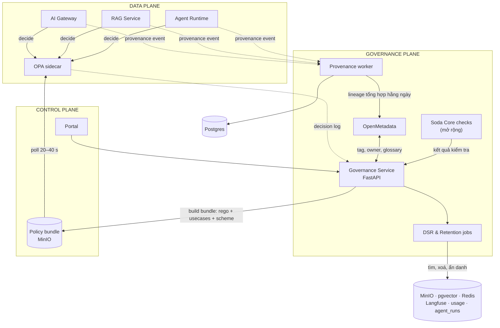

### 26.4 Governance gắn vào luồng request

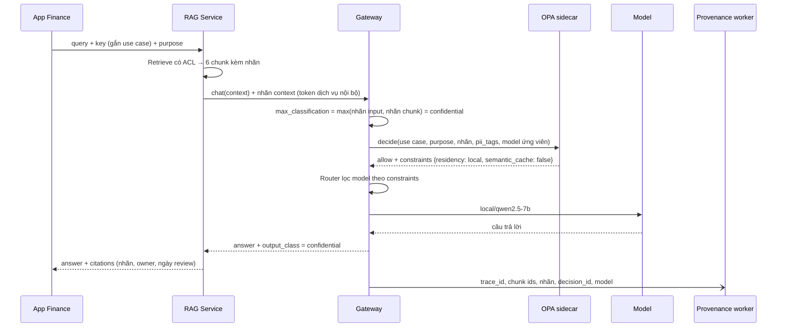

Thay đổi với chuỗi middleware ở [§7.2](#72-chuỗi-middleware):

| Bước mới | Vị trí | Thời gian | Nội dung |
|---|---|---|---|
| `governance.classify_input` | Trong bước 3 guard.input | ~0 ms thêm | Từ kết quả PII sinh `pii_tags` và nhãn tối thiểu của input |
| `governance.decide` | Sau bước 4 cache, trước router | ~3 ms | Gọi OPA sidecar qua localhost; cache quyết định 30 s theo (use case, purpose, nhãn, pii_tags) |
| `governance.provenance` | Cùng lúc metering | async | Phát provenance event vào Redis Streams |

**Tin nhãn từ đâu?** Gateway chỉ nhận nhãn context từ dịch vụ nội bộ có danh tính (`svc-rag`, `svc-agent`, xác thực bằng token dịch vụ). Header nhãn do app bên ngoài tự gửi bị bỏ qua. App gọi thẳng API thống nhất không qua RAG thì gateway tự phân loại input, mặc định `internal`.

**Use case và mục đích đến từ đâu?** Mỗi API key gắn với đúng một use case. `purpose` lấy từ `metadata.purpose` (API thống nhất) hoặc header `X-Ben-Purpose` (passthrough); không gửi thì dùng mục đích mặc định của use case.

### 26.5 Vai trò & RACI

| Hoạt động | Data Owner | Data Steward | DPO | Tenant Admin | Platform Admin |
|---|:-:|:-:|:-:|:-:|:-:|
| Gán nhãn tài liệu | A | R | I | C | |
| Hạ nhãn Confidential → Internal | A/R | C | I | | |
| Hạ nhãn Restricted | R | C | A | | |
| Đăng ký use case AI | C | | C | R | I |
| Phê duyệt use case có dữ liệu cá nhân | C | | A | R | C |
| Xử lý yêu cầu xoá dữ liệu | I | | A/R | I | C |
| Đặt thời hạn lưu trữ | C | | A | I | R |
| Viết và review policy Rego | | | C | C | A/R |
| Xác nhận lại tài liệu định kỳ | A | R | | I | |

*R = thực hiện · A = chịu trách nhiệm cuối · C = được hỏi ý kiến · I = được thông báo*

### 26.6 Hai hành trình governance

#### Hành trình 7 — Câu hỏi chạm dữ liệu mật

**Quân** — chuyên viên Finance — dùng trợ lý tài chính (use case `finance-assistant`, được phép tới mức Confidential).

**Lần 1.** Quân hỏi: *"Tóm tắt kế hoạch giá Q4 cho ngành hàng điện thoại."* (`purpose: internal_analysis`)

- RAG kéo về 2 chunk từ **"Kế hoạch giá Q4 v2" — Confidential**.
- OPA cho phép nhưng ràng buộc `residency: local`, `semantic_cache: false`.
- Router bỏ Claude cloud, dùng `local/qwen2.5-7b`. Trace ghi rõ lý do.

**Lần 2.** Quân hỏi: *"Soạn email gửi đối tác phân phối tóm tắt kế hoạch giá Q4."* (`purpose: external_communication`)

Decision log:

```json
{
  "decision_id": "dec_01JA2K7Q...",
  "ts": "2026-10-02T09:14:31Z",
  "trace_id": "9c2e41...",
  "input": {
    "tenant": "finance",
    "usecase_id": "finance-assistant",
    "purpose": "external_communication",
    "user": { "id_hash": "u_5d1...", "groups": ["dept-finance"] },
    "context": {
      "max_classification": "confidential",
      "pii_tags": [],
      "sources": ["doc_ke-hoach-gia-q4@v2"]
    },
    "model_candidates": ["anthropic/claude-sonnet-5", "local/qwen2.5-7b"]
  },
  "result": {
    "allow": false,
    "reasons": ["external_purpose_with_confidential"],
    "constraints": [{ "residency": "local" }, { "semantic_cache": false }]
  },
  "bundle_revision": "ben-policies@2026-10-01.3"
}
```

Quân nhận được:

```json
{
  "error": {
    "type": "policy_denied",
    "message": "Nội dung dùng tài liệu mức Confidential (Kế hoạch giá Q4 v2) cho mục đích liên lạc bên ngoài. Chính sách không cho phép. Nếu cần chia sẻ, đề nghị Data Owner (finance-lead@shopviet.vn) phê duyệt một bản tóm tắt hạ nhãn.",
    "reasons": ["external_purpose_with_confidential"],
    "trace_id": "9c2e41..."
  }
}
```

#### Hành trình 8 — Khách hàng yêu cầu xoá dữ liệu

Một khách gọi tổng đài yêu cầu xoá toàn bộ dữ liệu cá nhân. CSKH xác minh danh tính theo quy trình sẵn có, chuyển cho DPO. DPO tạo yêu cầu trên Portal bằng số điện thoại khách. Sau khi xem trước và duyệt:

```
┌─ Báo cáo xử lý yêu cầu xoá · DSR-2026-0042 ─────────────────────────────────┐
│ Loại: Xoá dữ liệu      Tiếp nhận: 02/10/2026 09:00      Hoàn tất: 09:04      │
│ Định danh: SĐT (đã xác minh bởi CSKH)      subject_key: sk_7a91…             │
│                                                                              │
│ Nơi lưu              Tìm thấy   Hành động                       Tìm lại      │
│ Tài liệu (MinIO)     1 file     Tạo version đã che, xoá bản cũ     0 ✓       │
│ Chunks (pgvector)    3 chunk    Xoá + index lại                    0 ✓       │
│ Cache (Redis)        2 mục      Xoá                                0 ✓       │
│ Trace (Langfuse)     14 trace   Xoá qua API                        0 ✓       │
│ usage_events         14 dòng    Ẩn danh hoá user_ref               0 ✓       │
│ Agent runs           0          —                                  0 ✓       │
│ Log (Loki)           Không chứa nội dung; tự hết hạn sau 30 ngày   —         │
│ Audit log            Giữ lại để chứng minh đã xử lý; chỉ chứa hash —         │
│ Provider cloud       Chỉ từng nhận placeholder; lưu giữ theo hợp đồng (DPIA) │
│                                                                              │
│ Legal hold: không     Người duyệt: dpo@shopviet.vn     sha256: 3be0c1…        │
└──────────────────────────────────────────────────────────────────────────────┘
```

*(số minh hoạ)*

---

## 27. Phân loại dữ liệu

### 27.1 Thang nhãn

Hai chiều độc lập: **mức mật** (một giá trị) và **thẻ dữ liệu cá nhân** (nhiều giá trị).

| Mức | Định nghĩa | Ví dụ ở ShopViet |
|---|---|---|
| **Public** | Được phép công bố ra ngoài | FAQ, chính sách đổi trả công khai |
| **Internal** | Chỉ nhân viên; lộ ra gây thiệt hại nhỏ | Quy chế chung, quy trình nội bộ |
| **Confidential** | Chỉ nhóm được phép; lộ ra gây thiệt hại đáng kể | Kế hoạch giá, doanh thu chi tiết, quy chế thưởng theo phòng |
| **Restricted** | Lộ ra gây thiệt hại nghiêm trọng; dữ liệu cá nhân nhạy cảm ở dạng thô | Lương từng người, CCCD, số tài khoản, hồ sơ sức khoẻ |

| Thẻ | Ví dụ |
|---|---|
| `pii:none` | Không có dữ liệu cá nhân |
| `pii:basic` | Họ tên, SĐT, email, địa chỉ, mã đơn gắn với người |
| `pii:sensitive` | Nhóm dữ liệu cá nhân nhạy cảm — **lấy danh mục theo văn bản pháp luật hiện hành**, không tự định nghĩa |

> Luật Dữ liệu có cách phân loại riêng (dữ liệu cốt lõi, dữ liệu quan trọng...). Nếu cần, ghi thêm ánh xạ trong `docs/governance/classification-scheme.md` sau khi đối chiếu văn bản gốc.

### 27.2 Nhãn gắn vào đâu

| Đối tượng | Nhãn | Ai đặt |
|---|---|---|
| Tài liệu | Mức mặc định cho mọi chunk | Owner xác nhận (hệ thống đề xuất) |
| Chunk | Có thể **cao hơn** tài liệu (ví dụ phụ lục bảng lương) | Tự đề xuất, steward xác nhận |
| Cột bảng (`reporting.*`) | Mức + thẻ PII theo cột | Steward trên OpenMetadata |
| Tool | `max_classification` được nhận/gửi đi (ví dụ `send_email`: Internal) | Platform Admin khi duyệt tool |
| Use case | `max_classification` được phép xử lý | Phê duyệt trong AI Registry |
| Input request | Nhãn tối thiểu suy ra từ PII phát hiện được | Gateway |
| Output | Kế thừa nhãn cao nhất của context | Tự động |

### 27.3 Tự đề xuất nhãn lúc ingest

Pipeline ingest ở [§8.1](#81-ingest) thêm bước `classify` sau `scan`; tài liệu chuyển sang `awaiting_label` cho đến khi owner xác nhận.

`config/classification-scheme.yaml`:

```yaml
levels: [public, internal, confidential, restricted]
default_level: internal
never_auto_downgrade: true          # hệ thống chỉ được đề xuất nâng nhãn
unconfirmed_policy: use_higher      # đề xuất cao hơn nhãn owner chọn → dùng nhãn cao hơn tới khi xác nhận
rules:
  - name: pii_sensitive
    when: { pii_any: [cccd, bank_account] }
    suggest: restricted
  - name: salary_keywords
    when: { keywords_any: ["bảng lương", "mức lương", "thu nhập cá nhân"] }
    suggest: confidential
  - name: marked_confidential
    when: { keywords_any: ["MẬT", "KHÔNG PHỔ BIẾN", "CONFIDENTIAL"] }
    suggest: confidential
llm_classifier:
  enabled: true
  model: local/qwen2.5-7b           # không bao giờ gửi tài liệu chưa phân loại ra cloud
  min_confidence: 0.7
  below_confidence: suggest_higher
```

Màn hình xác nhận:

```
┌─ Xác nhận nhãn · Quy chế thưởng — Phòng Kinh doanh.docx ─────────────────┐
│ Owner chọn khi upload:   Internal                                        │
│ Hệ thống đề xuất:        Confidential  (rule: salary_keywords, LLM 0,82) │
│ Chunk cao hơn:           Phụ lục 2 › Bảng thưởng cá nhân → Restricted     │
│                           (phát hiện: họ tên + số tiền theo người)       │
│ Đang áp dụng tạm:        Confidential                                    │
│                                                                          │
│ [Giữ đề xuất]   [Chọn nhãn khác + lý do]   [Loại Phụ lục 2 khỏi RAG]      │
└──────────────────────────────────────────────────────────────────────────┘
```

### 27.4 Quy tắc lan truyền nhãn

1. **Context** = nhãn cao nhất của input và mọi chunk, bảng, output tool đưa vào model.
2. **Câu trả lời** kế thừa nhãn context.
3. **Báo cáo agent tạo ra** kế thừa nhãn cao nhất của mọi dữ liệu đã đọc trong lượt chạy.
4. **Tool** chỉ nhận dữ liệu có nhãn ≤ `max_classification` của tool.
5. **Cache** lưu nhãn cùng mục; chỉ trả cho request được phép ở nhãn đó và cùng nhóm quyền.
6. **Hạ nhãn** chỉ do người có quyền (§26.5), bắt buộc lý do, ghi audit, tạo version mới.

### 27.5 Ma trận xử lý theo nhãn

| | Public | Internal | Confidential | Restricted |
|---|:-:|:-:|:-:|:-:|
| Model cloud | ✅ | ✅ nếu hợp đồng provider cam kết không dùng dữ liệu để huấn luyện | ❌ | ❌ |
| Model local | ✅ | ✅ | ✅ | ❌ ở dạng thô; chỉ khi đã che |
| Exact cache | ✅ | ✅ | ✅ TTL 1 giờ, khoá theo nhóm quyền | ❌ |
| Semantic cache | ✅ | ✅ | ❌ | ❌ |
| Lưu nội dung prompt trong trace | ✅ 30 ngày | ✅ 30 ngày | ❌ chỉ metadata | ❌ |
| Tool gửi ra ngoài (email) | ✅ | ✅ chỉ nội bộ | ❌ trừ khi Data Owner duyệt | ❌ |
| Được hạ nhãn bởi | — | Data Steward | Data Owner | Data Owner + DPO |

---

## 28. Policy-as-code với OPA

### 28.1 Kiến trúc

- **OPA chạy sidecar** cạnh gateway, RAG, agent; gọi qua `localhost` để đạt p95 < 5 ms (NFR-15).
- **Bundle** gồm `config/rego/*.rego` + `data.json` (use case, thang nhãn, danh sách mục đích bên ngoài). Governance service build bằng `opa build` khi có thay đổi đã merge, đẩy lên bucket nội bộ trên MinIO.
- OPA **tự kéo bundle** định kỳ; bundle lỗi bị từ chối, OPA giữ bản cũ.
- **Decision log** gửi về governance service → bảng `policy_decisions` → audit và dashboard.

`deploy/opa/config.yaml`:

```yaml
services:
  bundles:
    url: http://minio:9000/ben-policy-bundles
  governance:
    url: http://governance:8080/opa
bundles:
  ben:
    service: bundles
    resource: ben.tar.gz
    polling:
      min_delay_seconds: 20
      max_delay_seconds: 40
decision_logs:
  service: governance
  reporting:
    min_delay_seconds: 5
    max_delay_seconds: 10
```

### 28.2 Policy chính

`config/rego/authz.rego`:

```rego
package ben.authz

import rego.v1

levels := {"public": 0, "internal": 1, "confidential": 2, "restricted": 3}

usecase := data.usecases[input.usecase_id]

ctx_level := levels[input.context.max_classification]

decision := {
	"allow": count(deny) == 0,
	"reasons": deny,
	"constraints": constraints,
}

# --- Use case & mục đích ---------------------------------------------
deny contains "usecase_unknown" if not data.usecases[input.usecase_id]

deny contains "usecase_not_approved" if usecase.status != "approved"

deny contains "purpose_not_registered" if not input.purpose in usecase.purposes

# --- Nhãn dữ liệu -------------------------------------------------------
deny contains "classification_exceeds_usecase" if {
	ctx_level > levels[usecase.max_classification]
}

deny contains "restricted_data_in_llm" if {
	input.action == "llm_call"
	input.context.max_classification == "restricted"
}

deny contains "external_purpose_with_confidential" if {
	input.purpose in data.external_purposes
	ctx_level >= levels.confidential
}

# --- Tool của agent -----------------------------------------------------
deny contains sprintf("tool_%s_cannot_receive_%s", [input.tool.name, input.context.max_classification]) if {
	input.action == "tool_call"
	ctx_level > levels[input.tool.max_classification]
}

# --- Ràng buộc trả về cho router / cache -------------------------------
constraints contains {"residency": "local"} if ctx_level >= levels.confidential

constraints contains {"semantic_cache": false} if ctx_level >= levels.confidential

constraints contains {"trace_content": false} if ctx_level >= levels.confidential

constraints contains {"pii": "mask"} if "pii:sensitive" in input.context.pii_tags
```

`config/rego/authz_test.rego`:

```rego
package ben.authz_test

import rego.v1

import data.ben.authz

usecases := {"finance-assistant": {
	"status": "approved",
	"purposes": ["internal_analysis", "external_communication"],
	"max_classification": "confidential",
}}

base := {
	"action": "llm_call",
	"usecase_id": "finance-assistant",
	"purpose": "internal_analysis",
	"context": {"max_classification": "confidential", "pii_tags": []},
}

test_confidential_allowed_but_forced_local if {
	d := authz.decision with input as base with data.usecases as usecases
	d.allow
	{"residency": "local"} in d.constraints
}

test_confidential_external_purpose_denied if {
	i := object.union(base, {"purpose": "external_communication"})
	d := authz.decision
		with input as i
		with data.usecases as usecases
		with data.external_purposes as ["external_communication"]
	not d.allow
	"external_purpose_with_confidential" in d.reasons
}

test_unapproved_usecase_denied if {
	u := {"finance-assistant": object.union(usecases["finance-assistant"], {"status": "assessment"})}
	d := authz.decision with input as base with data.usecases as u
	"usecase_not_approved" in d.reasons
}
```

### 28.3 Khi OPA không trả lời

| Nhãn context | Hành vi |
|---|---|
| ≥ Confidential | Chặn, `503 policy_unavailable` |
| ≤ Internal | Dùng quyết định cache gần nhất nếu có; không có thì cho qua với ràng buộc mặc định an toàn (`residency: local` nếu có `pii:*`), ghi cảnh báo |

Hành vi này được viết thành test chaos ở [§17](#17-kịch-bản-lỗi).

---

## 29. Data catalog, lineage & provenance

### 29.1 Đưa gì lên OpenMetadata

| Trong Bến | Trên OpenMetadata | Cách đưa lên |
|---|---|---|
| Schema `reporting` (doanh thu, đơn hàng) | Database → Table, cột có tag | Connector Postgres có sẵn, chạy theo lịch |
| Bucket tài liệu RAG | Container | Connector S3 trỏ vào MinIO (kiểm tra tương thích khi dựng) |
| Collection RAG, tài liệu | Container + custom property `ben.collection`, `ben.classification` | API từ governance service |
| Use case AI | Entity ML Model + custom property (hoặc entity chuyên cho ứng dụng AI nếu phiên bản hỗ trợ) | API từ AI Registry |
| Ingest worker | Pipeline | API |
| Thang nhãn | Classification `BenDataClass`: Public, Internal, Confidential, Restricted | API, một lần |
| Thẻ dữ liệu cá nhân | Classification PII có sẵn của OpenMetadata | Ánh xạ |
| Thuật ngữ nghiệp vụ | Glossary: *Khách hàng, Đơn hàng, Doanh thu thuần, Hoàn tiền...* | Steward nhập |
| Owner | Team / User đồng bộ từ nhóm Keycloak | Job đồng bộ |

### 29.2 Hai tầng lineage

| | Chi tiết — mỗi request | Tổng hợp — mỗi ngày |
|---|---|---|
| Nơi lưu | Postgres `answer_provenance` | OpenMetadata lineage |
| Nội dung | trace_id, use case, chunk + version, bảng + cột, nhãn, model, decision_id | Cạnh `nguồn → use case → sản phẩm đầu ra`, kèm số lần dùng |
| Dùng để | Điều tra một câu trả lời, xử lý DSR, kiểm toán | Nhìn toàn cảnh, đánh giá tác động khi đổi/xoá nguồn |
| Thời hạn | Theo §30.5 | Lâu dài |

**Vì sao không đẩy từng request lên catalog:** 300.000 request/tháng chỉ riêng CSKH sẽ biến đồ thị lineage thành vô dụng và làm quá tải catalog. Catalog cần *cấu trúc*, không cần *sự kiện* (ADR-015).

Ví dụ lineage tổng hợp:

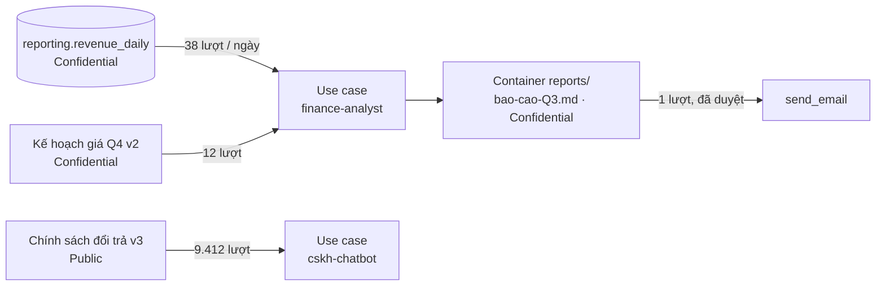

### 29.3 Nguồn sự thật

| Thông tin | Nguồn sự thật | Chiều đồng bộ |
|---|---|---|
| Nhãn tài liệu và chunk RAG | Bến (Portal) | Bến → OpenMetadata |
| Tag cột bảng `reporting.*` | OpenMetadata (steward gán) | OpenMetadata → Bến (mở rộng: webhook; MVP: đọc theo lịch) |
| Owner tài liệu | Bến | Bến → OpenMetadata |
| Owner bảng, glossary | OpenMetadata | Chỉ đọc |
| Use case | Bến AI Registry | Bến → OpenMetadata |

Tool `sql_query` dùng tag cột: cột Restricted bị loại khỏi `SELECT`; cột Confidential chỉ trả khi use case được phép; nhãn kết quả = tag cao nhất trong các cột đã trả.

### 29.4 Provenance trong câu trả lời

```json
{
  "answer": "Giá niêm yết dòng điện thoại tầm trung giảm 5–8% từ tuần 42 [1].",
  "classification": "confidential",
  "citations": [
    {
      "n": 1,
      "document": "Kế hoạch giá Q4",
      "version": 2,
      "section": "Mục 3 › Điện thoại",
      "classification": "confidential",
      "owner": "finance-lead@shopviet.vn",
      "certified_until": "2026-12-31"
    }
  ],
  "governance": {
    "decision_id": "dec_01JA2K6F...",
    "constraints": ["residency:local", "semantic_cache:false"],
    "model": "local/qwen2.5-7b"
  },
  "trace_id": "71b0..."
}
```

---

## 30. Quyền của chủ thể dữ liệu & thời hạn lưu trữ

### 30.1 Dữ liệu cá nhân nằm ở đâu trong Bến

| Nơi lưu | Có thể chứa | Tìm bằng | Xử lý khi xoá |
|---|---|---|---|
| Tài liệu gốc (MinIO) | Biên bản khiếu nại có SĐT, tên | `subject_index` | Tạo version đã che, xoá version cũ |
| Chunks (pgvector) | Như trên | `subject_index` | Xoá chunk, index lại từ version đã che |
| Cache (Redis) | Câu trả lời liên quan | Tag subject key trên mục cache | Xoá |
| Trace (Langfuse) | Prompt đã che, metadata người dùng | `user_ref_hash` | Xoá trace qua API |
| `usage_events` | `user_ref_hash` | Cột hash | Ẩn danh hoá (đặt NULL) |
| `agent_runs`, báo cáo | Kết quả tool có thể chứa tên khách | `subject_index` | Che nội dung bước, tạo version báo cáo đã che |
| Log (Loki) | Không chứa nội dung, chỉ hash | — | Không xoá từng dòng; dựa vào thời hạn 30 ngày (đánh đổi ghi ở ADR-016) |
| `audit_logs` | Chỉ hash, hành động | — | Giữ lại để chứng minh đã xử lý |
| Provider cloud | Chỉ placeholder (§7.3) | — | Theo chính sách lưu giữ trong hợp đồng; ghi vào DPIA |

### 30.2 Subject key

Không bao giờ lưu định danh gốc để tìm kiếm. Mỗi lần phát hiện định danh (lúc ingest tài liệu, lúc guard xử lý request, lúc agent đọc dữ liệu), hệ thống ghi **subject key** vào `subject_index`:

```python
# Minh hoạ
def subject_key(kind: str, value: str) -> str:
    normalized = normalize(kind, value)        # SĐT: bỏ khoảng trắng, "+84" → "0"; email: chữ thường
    digest = hmac.new(SUBJECT_SECRET, f"{kind}:{normalized}".encode(), hashlib.sha256).hexdigest()
    return "sk_" + digest[:32]
```

- `SUBJECT_SECRET` nằm trong secret store; không có khoá thì không đoán ngược được từ SĐT.
- Đổi khoá = dựng lại index (ADR-016).

### 30.3 Quy trình yêu cầu của chủ thể dữ liệu

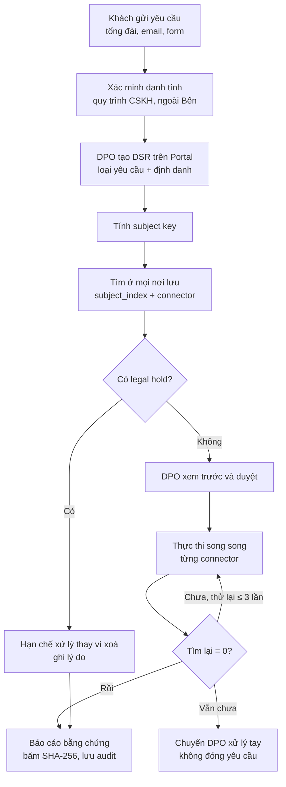

Mỗi nơi lưu là một connector cùng giao diện — thêm nơi lưu mới không phải sửa quy trình:

```python
# Minh hoạ interface
class SubjectDataConnector(Protocol):
    name: str
    async def find(self, keys: list[str]) -> list[Location]: ...
    async def erase(self, locations: list[Location]) -> EraseResult: ...
    async def restrict(self, keys: list[str]) -> None: ...
    async def export(self, locations: list[Location]) -> ExportBundle: ...   # yêu cầu truy cập (mở rộng)
```

| Loại yêu cầu | Hệ thống làm gì | Phạm vi |
|---|---|---|
| Xoá | Tìm → duyệt → xoá/ẩn danh → tìm lại → báo cáo | MVP |
| Hạn chế xử lý | Ghi `subject_restrictions`; guard chặn request chứa subject key đó (`403 subject_restricted`), RAG loại chunk liên quan | MVP |
| Rút lại đồng ý | Như hạn chế xử lý, cộng thông báo cho use case liên quan | MVP |
| Truy cập | Xuất gói dữ liệu và lịch sử AI đã xử lý | Mở rộng |

**Hạn xử lý:** cấu hình trong `retention.yaml` (`dsr.due_hours`). Đặt theo thời hạn trong văn bản pháp luật hiện hành — không mặc định một con số.

### 30.4 Thời hạn lưu trữ

`config/retention.yaml` (giá trị gợi ý cho demo, chỉnh theo chính sách công ty):

| Loại dữ liệu | Public / Internal | Confidential | Restricted | Ghi chú |
|---|---|---|---|---|
| Nội dung prompt/response trong Langfuse | 30 ngày | Không lưu nội dung | Không lưu | Metadata vẫn giữ theo trace |
| Metadata trace | 90 ngày | 90 ngày | 90 ngày | |
| `answer_provenance` | 13 tháng | 13 tháng | 13 tháng | Chỉ id, không nội dung |
| `policy_decisions` | 13 tháng | 13 tháng | 13 tháng | |
| `usage_events` | 13 tháng | 13 tháng | 13 tháng | Đối soát chi phí |
| Exact cache | Theo policy tenant | 1 giờ | Không cache | |
| Log (Loki) | 30 ngày | 30 ngày | 30 ngày | Không chứa nội dung |
| `audit_logs` | 1 năm | 1 năm | 1 năm | Chỉ ghi thêm |
| Báo cáo agent | 1 năm | 1 năm | — | |

Job `retention_sweeper` chạy hằng đêm, bỏ qua mọi bản ghi thuộc phạm vi `legal_holds` còn hiệu lực, ghi số lượng đã xoá vào audit.

---

## 31. Chất lượng & vòng đời nguồn dữ liệu

### 31.1 Vòng đời tài liệu

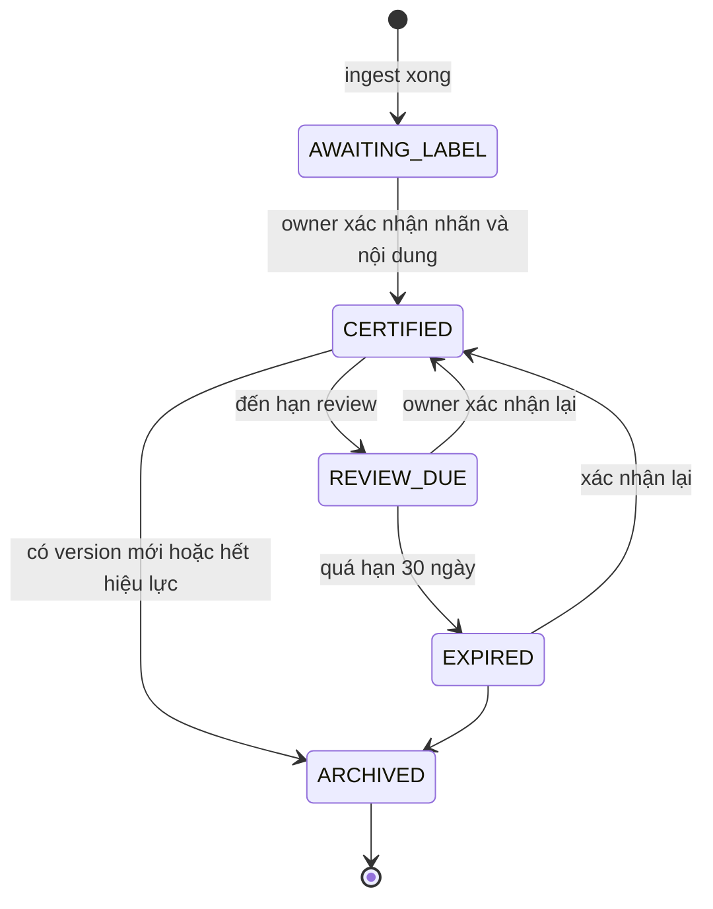

| Trạng thái | RAG có dùng không | Hiển thị cho người dùng |
|---|---|---|
| `AWAITING_LABEL` | Không | — |
| `CERTIFIED` | Có | Bình thường |
| `REVIEW_DUE` | Có | Chú thích *"nguồn đang chờ xác nhận lại"* |
| `EXPIRED` | Tuỳ use case: `cskh` loại bỏ, `hr` dùng kèm cảnh báo | *"nguồn chưa được xác nhận lại từ 03/2026"* |
| `ARCHIVED` | Không | — |

### 31.2 Phát hiện mâu thuẫn giữa tài liệu (mở rộng)

Khi ingest, lấy các chunk giống nhau nhất (cosine > 0,85) từ tài liệu **khác** trong cùng collection, cho model local đánh giá có mâu thuẫn về số liệu hoặc quy định không. Có thì tạo vấn đề cho steward:

```
⚠ Mâu thuẫn tiềm ẩn · DQ-0187 · collection cskh-policies
  [A] Chính sách đổi trả v3 (CERTIFIED 05/2026)   › Điều 2: "đổi hàng trong 7 ngày kể từ khi nhận"
  [B] FAQ mùa sale 2025 (REVIEW_DUE)              › Câu 14: "đổi hàng trong 15 ngày"
  Độ tương đồng 0,91 · Đánh giá: mâu thuẫn về thời hạn (tin cậy 0,86)
  Giao cho: steward cskh · Hạn xử lý: 3 ngày
```

### 31.3 Kiểm tra bảng cho agent (mở rộng)

`config/soda/reporting.yml`:

```yaml
checks for reporting.revenue_daily:
  - row_count > 0
  - freshness(updated_at) < 1d
  - missing_count(category) = 0
  - duplicate_count(order_date, category) = 0
```

Kết quả ghi `data_quality_issues`. Khi bảng đang có kiểm tra thất bại, tool `sql_query` vẫn trả dữ liệu nhưng kèm cảnh báo cho agent (*"dữ liệu chưa cập nhật từ 30/09"*), và báo cáo agent tạo ra ghi rõ cảnh báo này.

---

## 32. AI Registry & đánh giá tác động

### 32.1 Đăng ký use case

`config/usecases/cskh-chatbot.yaml`:

```yaml
id: cskh-chatbot
name: Chatbot chăm sóc khách hàng
tenant: cskh
owner: lan@shopviet.vn
business_purpose: Trả lời câu hỏi của khách về đơn hàng, đổi trả, giao hàng
purposes: [customer_support]
default_purpose: customer_support
users: external_customers
data:
  max_classification: internal
  personal_data: [phone, order_id, name]
  sensitive_personal_data: []
  handling: { pii: redact }
models:
  allowed: [local/qwen2.5-7b, anthropic/claude-haiku-4-5, anthropic/claude-sonnet-5]
  cross_border_transfer: true            # có dùng provider cloud
automation:
  makes_decisions_about_people: false
  external_actions: []
risk:
  tier: medium
  rationale: Người dùng là khách hàng bên ngoài; có dữ liệu cá nhân cơ bản (đã che); có dùng model cloud
assessments:
  dpia: docs/governance/dpia/cskh-chatbot.md
  cross_border: docs/governance/cross-border/cskh-chatbot.md
  eval_report: evals/reports/cskh/latest.md
lifecycle:
  status: approved
  approved_by: [dpo@shopviet.vn, platform-admin@shopviet.vn]
  approved_at: 2026-10-01
  review_due: 2027-04-01
```

### 32.2 Vòng đời use case

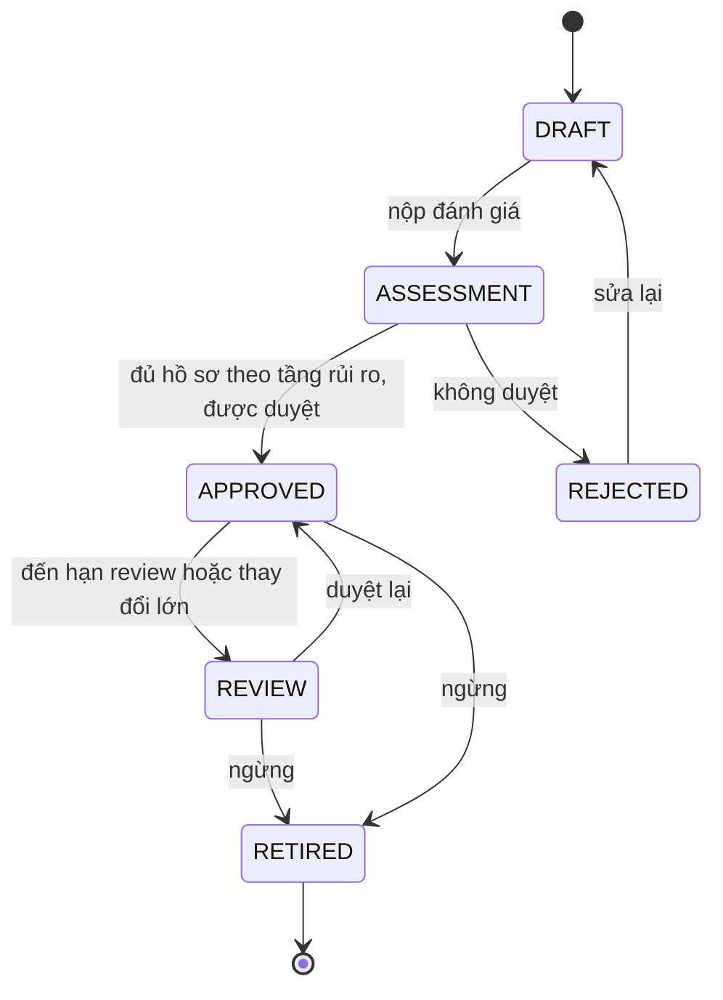

| Trạng thái use case | Key `bk_test_` | Key `bk_live_` |
|---|---|---|
| `DRAFT`, `ASSESSMENT`, `REJECTED` | ✅ chỉ dữ liệu mẫu, nhãn ≤ Internal | ❌ `usecase_not_approved` |
| `APPROVED` | ✅ | ✅ |
| `REVIEW` (quá hạn) | ✅ | ⚠️ theo policy: cảnh báo, sau 14 ngày chặn |
| `RETIRED` | ❌ | ❌ |

**"Thay đổi lớn" tự kích hoạt review:** thêm model cloud, nâng `max_classification`, thêm loại dữ liệu cá nhân, thêm tool external.

### 32.3 Phân tầng rủi ro

| Tầng | Tiêu chí (chỉ cần một) | Yêu cầu trước khi lên production | Chu kỳ review |
|---|---|---|---|
| **Thấp** | Chỉ Public/Internal, người dùng nội bộ, không dữ liệu cá nhân, không hành động ra ngoài | Đăng ký + eval cơ bản | 12 tháng |
| **Trung bình** | Có dữ liệu cá nhân cơ bản; người dùng bên ngoài; dùng model cloud | + DPIA rút gọn, đánh giá chuyển dữ liệu ra nước ngoài nếu dùng cloud, ngưỡng eval, DPO duyệt | 6 tháng |
| **Cao** | Dữ liệu Confidential hoặc nhạy cảm; hỗ trợ quyết định ảnh hưởng tới người (tuyển dụng, tín dụng, kỷ luật); agent có hành động ra ngoài | + DPIA đầy đủ, human-in-the-loop bắt buộc, red-team, hội đồng AI Governance duyệt | 3 tháng |

Ba use case demo: `cskh-chatbot` — Trung bình · `hr-assistant` — Cao (dữ liệu nhân sự) · `finance-analyst` — Cao (Confidential + gửi email).

### 32.4 Hồ sơ tự sinh

**DPIA** — `GET /gov/v1/usecases/{id}/dpia` sinh bản nháp Markdown, người phụ trách hoàn thiện phần đánh giá:

| Mục | Nguồn tự điền |
|---|---|
| 1. Mô tả hoạt động xử lý | AI Registry |
| 2. Mục đích và cơ sở xử lý | AI Registry (người phụ trách bổ sung cơ sở) |
| 3. Loại dữ liệu, nhóm chủ thể | AI Registry + thẻ PII thực tế từ `subject_index` |
| 4. Luồng dữ liệu | Lineage tổng hợp §29.2 |
| 5. Bên nhận, chuyển ra nước ngoài | Model catalog (`residency`) + model thực tế dùng trong 30 ngày |
| 6. Rủi ro và biện pháp | Danh sách kiểm soát đang bật: che PII, OPA, ACL, thời hạn lưu trữ, người duyệt |
| 7. Thời hạn lưu trữ | `retention.yaml` |
| 8. Kết luận, phê duyệt | Người phụ trách + DPO |

**ROPA** — `GET /gov/v1/ropa` xuất CSV: use case · owner · mục đích · loại dữ liệu cá nhân · nhóm chủ thể · bên nhận · chuyển ra nước ngoài · thời hạn lưu trữ · biện pháp bảo vệ · ngày review.

### 32.5 Ánh xạ nghĩa vụ → tính năng

> ⚠️ Bảng này để **định hướng thiết kế**, không phải tư vấn pháp lý và không khẳng định hệ thống "đã tuân thủ". Trước khi viết vào tài liệu chính thức, đọc văn bản gốc: Nghị định 13/2023/NĐ-CP về bảo vệ dữ liệu cá nhân, Luật Bảo vệ dữ liệu cá nhân 2025, Luật Dữ liệu 2024 và các văn bản hướng dẫn — kiểm tra hiệu lực và điều khoản cụ thể.

| Nhóm nghĩa vụ / nguyên tắc | Tính năng trong Bến |
|---|---|
| Xử lý đúng mục đích đã xác định | `purpose` trong request; OPA `purpose_not_registered` |
| Tối thiểu hoá dữ liệu | Che PII trước khi gửi model; không lưu nội dung trace với dữ liệu mật |
| Phân loại và bảo vệ theo mức độ quan trọng | Thang nhãn §27; ma trận xử lý §27.5 |
| Quyền của chủ thể dữ liệu (xoá, hạn chế xử lý, rút đồng ý, truy cập...) | DSR §30.3 |
| Lưu trữ có thời hạn | `retention.yaml` + job dọn + legal hold |
| Đánh giá tác động xử lý dữ liệu cá nhân | DPIA §32.4 theo tầng rủi ro |
| Chuyển dữ liệu cá nhân ra nước ngoài | `residency` trong policy; hồ sơ đánh giá theo use case; `cross_border_transfer` trong registry |
| Ghi nhận, chứng minh việc tuân thủ | Audit log, decision log, báo cáo bằng chứng DSR, ROPA |
| Thông báo khi có vi phạm | Cảnh báo guardrail/OPA bất thường + runbook sự cố (thời hạn thông báo lấy theo văn bản) |

| Khung tham chiếu quốc tế | Tương ứng trong Bến |
|---|---|
| ISO/IEC 42001 (hệ thống quản lý AI) | AI Registry, phân tầng rủi ro, chu kỳ review, vai trò & RACI |
| NIST AI RMF — Govern | Vai trò, RACI, phê duyệt use case |
| NIST AI RMF — Map | Registry: mục đích, dữ liệu, người dùng; lineage |
| NIST AI RMF — Measure | Eval, NFR governance, dashboard |
| NIST AI RMF — Manage | OPA, guardrail, người duyệt, xử lý sự cố |

---

## 33. Mô hình dữ liệu, API & dashboard governance

### 33.1 Bổ sung mô hình dữ liệu

```sql
-- Bổ sung cho bảng có sẵn ở §14
ALTER TABLE api_keys
  ADD COLUMN usecase_id text;                        -- mỗi key gắn đúng một use case

ALTER TABLE documents
  ADD COLUMN classification  text NOT NULL DEFAULT 'internal',
  ADD COLUMN suggested_class text,
  ADD COLUMN owner           text,
  ADD COLUMN steward         text,
  ADD COLUMN cert_status     text NOT NULL DEFAULT 'awaiting_label',
  ADD COLUMN certified_until date;

ALTER TABLE chunks
  ADD COLUMN classification text NOT NULL DEFAULT 'internal',
  ADD COLUMN pii_tags       text[] NOT NULL DEFAULT '{}';

ALTER TABLE tools
  ADD COLUMN max_classification text NOT NULL DEFAULT 'internal';

ALTER TABLE usage_events
  ADD COLUMN usecase_id    text,
  ADD COLUMN user_ref_hash text;

-- Bảng mới
CREATE TABLE usecases (
  id           text PRIMARY KEY,
  tenant_id    uuid NOT NULL REFERENCES tenants(id),
  spec         jsonb NOT NULL,
  risk_tier    text NOT NULL,                        -- low | medium | high
  status       text NOT NULL,                        -- draft|assessment|approved|rejected|review|retired
  approved_by  text[],
  review_due   date,
  updated_at   timestamptz NOT NULL DEFAULT now()
);

CREATE TABLE policy_decisions (
  decision_id      text NOT NULL,
  ts               timestamptz NOT NULL,
  trace_id         text,
  tenant_id        uuid NOT NULL,
  usecase_id       text,
  purpose          text,
  action           text NOT NULL,                    -- llm_call | tool_call | retrieve
  max_class        text NOT NULL,
  allow            boolean NOT NULL,
  reasons          text[] NOT NULL,
  constraints      jsonb NOT NULL,
  bundle_revision  text NOT NULL
) PARTITION BY RANGE (ts);

CREATE TABLE answer_provenance (
  trace_id       text PRIMARY KEY,
  ts             timestamptz NOT NULL,
  tenant_id      uuid NOT NULL,
  usecase_id     text NOT NULL,
  user_ref_hash  text,
  model          text NOT NULL,
  decision_id    text,
  output_class   text NOT NULL,
  sources        jsonb NOT NULL   -- [{"document_id","version","chunk_id","classification"}] hoặc [{"table","columns"}]
);
CREATE INDEX ON answer_provenance USING gin (sources jsonb_path_ops);

CREATE TABLE subject_index (
  subject_key  text NOT NULL,
  store        text NOT NULL,                        -- minio|chunks|redis|langfuse|usage|agent_runs
  location     text NOT NULL,
  first_seen   timestamptz NOT NULL DEFAULT now(),
  PRIMARY KEY (subject_key, store, location)
);

CREATE TABLE subject_restrictions (
  subject_key  text PRIMARY KEY,
  kind         text NOT NULL,                        -- restrict_processing | consent_withdrawn
  since        timestamptz NOT NULL DEFAULT now(),
  dsr_id       text
);

CREATE TABLE dsr_requests (
  id               text PRIMARY KEY,                 -- DSR-2026-0042
  kind             text NOT NULL,                    -- erasure|restriction|consent_withdrawal|access
  subject_keys     text[] NOT NULL,
  status           text NOT NULL,                    -- received|searching|awaiting_approval|executing|verifying|completed|escalated
  received_at      timestamptz NOT NULL,
  due_at           timestamptz NOT NULL,
  approved_by      text,
  completed_at     timestamptz,
  evidence_sha256  text
);

CREATE TABLE dsr_actions (
  dsr_id           text NOT NULL REFERENCES dsr_requests(id),
  store            text NOT NULL,
  found            int NOT NULL,
  action           text NOT NULL,
  remaining_after  int,
  attempts         int NOT NULL DEFAULT 0,
  executed_at      timestamptz,
  PRIMARY KEY (dsr_id, store)
);

CREATE TABLE legal_holds (
  id           bigserial PRIMARY KEY,
  scope        jsonb NOT NULL,                       -- {"subject_key": ...} | {"document_id": ...} | {"tenant": ...}
  reason       text NOT NULL,
  created_by   text NOT NULL,
  created_at   timestamptz NOT NULL DEFAULT now(),
  released_at  timestamptz
);

CREATE TABLE data_quality_issues (
  id          text PRIMARY KEY,                      -- DQ-0187
  kind        text NOT NULL,                         -- conflict | stale | check_failed
  subject     jsonb NOT NULL,
  detail      jsonb NOT NULL,
  assignee    text,
  status      text NOT NULL DEFAULT 'open',
  created_at  timestamptz NOT NULL DEFAULT now()
);
```

Không cần bảng riêng cho thời hạn lưu trữ: `config/retention.yaml` là nguồn sự thật, được kiểm soát bằng PR như policy.

### 33.2 API governance

| Method | Đường dẫn | Mô tả |
|---|---|---|
| GET | `/gov/v1/classification/pending` | Tài liệu, chunk chờ xác nhận nhãn |
| PUT | `/gov/v1/documents/{id}/classification` | Xác nhận hoặc đổi nhãn (hạ nhãn cần lý do và quyền) |
| POST/GET | `/gov/v1/usecases` | Đăng ký, liệt kê use case |
| POST | `/gov/v1/usecases/{id}/transitions` | `submit`, `approve`, `reject`, `retire` |
| GET | `/gov/v1/usecases/{id}/dpia` | Bản nháp DPIA (Markdown) |
| GET | `/gov/v1/ropa` | Xuất ROPA (CSV) |
| GET | `/gov/v1/provenance/{trace_id}` | Nguồn gốc một câu trả lời |
| GET | `/gov/v1/lineage?document_id=` | Use case nào đã dùng tài liệu, bao nhiêu lần |
| POST | `/gov/v1/dsr` | Tạo yêu cầu chủ thể dữ liệu |
| GET | `/gov/v1/dsr/{id}` | Trạng thái, kết quả tìm kiếm |
| POST | `/gov/v1/dsr/{id}/approve` | DPO duyệt thực thi |
| GET | `/gov/v1/dsr/{id}/evidence` | Báo cáo bằng chứng |
| POST/DELETE | `/gov/v1/legal-holds` | Tạo, gỡ legal hold |
| GET | `/gov/v1/dq/issues` | Vấn đề chất lượng dữ liệu |
| POST | `/gov/v1/opa/decisions` | Nhận decision log từ OPA (nội bộ) |

### 33.3 Governance dashboard

| Chỉ số | Mục tiêu | Nguồn |
|---|---|---|
| Request có context ≥ Confidential tới model cloud | 0 | `answer_provenance` × model catalog |
| Tài liệu đang dùng có owner và nhãn đã xác nhận | 100% | `documents` |
| Tài liệu quá hạn review | < 5% | `documents.certified_until` |
| Câu trả lời RAG/agent có provenance | 100% | trace × `answer_provenance` |
| Use case production quá hạn review | 0 | `usecases` |
| Yêu cầu chủ thể dữ liệu: thời gian xử lý trung vị / số quá hạn | < 24 h / 0 | `dsr_requests` |
| Quyết định OPA bị từ chối, theo lý do | Theo dõi xu hướng | `policy_decisions` |
| Vấn đề chất lượng dữ liệu mở quá 7 ngày | 0 | `data_quality_issues` |
| Chuyển dữ liệu ra nước ngoài theo use case | Khớp với registry | `usage_events` × model catalog × `usecases` |

---

*Bến AI Platform · PROJECT.md v0.3 · 14/09/2026. Số liệu trong hành trình 6 (§3), §10.2, §18, §26.6 và §29 là minh hoạ. Giá model trong §7.5 cần kiểm tra lại với bảng giá chính thức trước khi benchmark. Nội dung pháp lý ở §27, §30 và §32.5 chỉ để định hướng thiết kế, không phải tư vấn pháp lý — đối chiếu văn bản gốc.*
