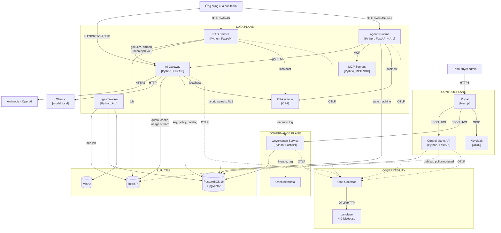

# C4 cấp 2 — Container

## Danh mục container

| Container | Công nghệ | Trách nhiệm | Trạng thái | Scale | Tuần |
|---|---|---|---|---|:-:|
| AI Gateway | FastAPI, SDK `anthropic`/`openai`, httpx | Điểm vào duy nhất tới model: auth, quota, guardrail, cache, router, adapter, metering | Stateless | Ngang theo CPU | 3–5 |
| RAG Service | FastAPI | Upload, truy vấn có ACL, trích dẫn | Stateless | Ngang | 6–7 |
| Ingest Worker | Arq | Parse, chunk, embed, index, phân loại | Stateless, job trong Redis | Theo độ dài hàng đợi | 6, 11 |
| Agent Runtime | FastAPI + Arq | Vòng lặp agent, state machine, duyệt | Trạng thái trong Postgres | Ngang | 8 |
| MCP Servers | MCP Python SDK | Tool `sql_query`, `search_docs`, `create_report`, `send_email` | Stateless | Mỗi tool một container | 8 |
| OPA sidecar | OPA | Quyết định policy | Bundle trong bộ nhớ | Theo pod cha | 11 |
| Portal | Next.js | Giao diện quản trị | Stateless | 1 | 10 |
| Control-plane API | FastAPI | Tenant, key, policy, prompt, tool, audit | Stateless | 1–2 | 2 (migration), 10 |
| Keycloak | Keycloak 26 | Đăng nhập, nhóm, role | Postgres | 1 | 2 |
| Governance Service | FastAPI | Phân loại, registry, provenance, DSR, retention, bundle | Stateless + job | 1 | 11–14 |
| OpenMetadata | OpenMetadata | Catalog, lineage, glossary | Riêng | 1 | 12 |
| PostgreSQL | pgvector/pgvector:pg16 | Cấu hình, usage, vector, agent state, governance | Có trạng thái | Dọc; replica đọc khi cần | 2 |
| Redis | redis:7.4 | Quota, cache, Streams, pub/sub, job queue | Có trạng thái (AOF) | Dọc | 2 |
| MinIO | MinIO | Tài liệu gốc, báo cáo, bundle policy, dữ liệu Langfuse | Có trạng thái | Dọc | 2 |
| OTel Collector | otelcol-contrib | Nhận và chuyển telemetry | Stateless | 1 | 2 |
| Langfuse + ClickHouse | Langfuse v4 | Trace LLM | Có trạng thái | 1 | 2 |
| Ollama | Ollama | Model local | Model trên volume | Theo GPU/CPU | 2 |

## Luồng chính

| # | Luồng | Đường đi |
|---|---|---|
| F1 | Chat qua API thống nhất | App → Gateway → (OPA) → Provider/Ollama → Gateway → App; usage → Redis Streams → Postgres |
| F2 | Hỏi đáp tài liệu | App → RAG → Postgres (ACL trong SQL) → Gateway → Model → RAG → App |
| F3 | Ingest tài liệu | App/Portal → RAG → MinIO + job Redis → Worker → Postgres |
| F4 | Agent có duyệt | App → Agent → Gateway/MCP → `WAITING_APPROVAL` → Portal → Agent → MCP |
| F5 | Đổi policy | Portal → Control-plane → Postgres → Redis pub/sub → Gateway nạp lại |
| F6 | Telemetry | Mọi service → OTel Collector → Langfuse |

## Triển khai môi trường dev (Docker Compose)

| Container | Service compose | File | Cổng host |
|---|---|---|---|
| AI Gateway | `gateway` | `docker-compose.yml` | 127.0.0.1:8000 |
| Migration schema | `migrate` (chạy xong thoát) | `docker-compose.yml` | — |
| PostgreSQL | `postgres` | `docker-compose.yml` | 127.0.0.1:5432 |
| Redis | `redis` | `docker-compose.yml` | 127.0.0.1:6379 |
| MinIO | `minio`, `minio-init` | `docker-compose.yml` | 127.0.0.1:9000, 9001 |
| Keycloak | `keycloak` | `docker-compose.yml` | 127.0.0.1:8080 |
| Ollama | `ollama` | `docker-compose.yml` | 127.0.0.1:11434 |
| OTel Collector | `otel-collector` | `docker-compose.observability.yml` | 127.0.0.1:4317, 4318 |
| Langfuse | `langfuse-web`, `langfuse-worker`, `clickhouse` | `docker-compose.observability.yml` | 127.0.0.1:3000 |

Postgres, Redis, MinIO dùng chung cho Bến, Keycloak và Langfuse ở môi trường dev (DB riêng: `ben`, `keycloak`, `langfuse`). Môi trường giống production (tuần 15) tách riêng.
