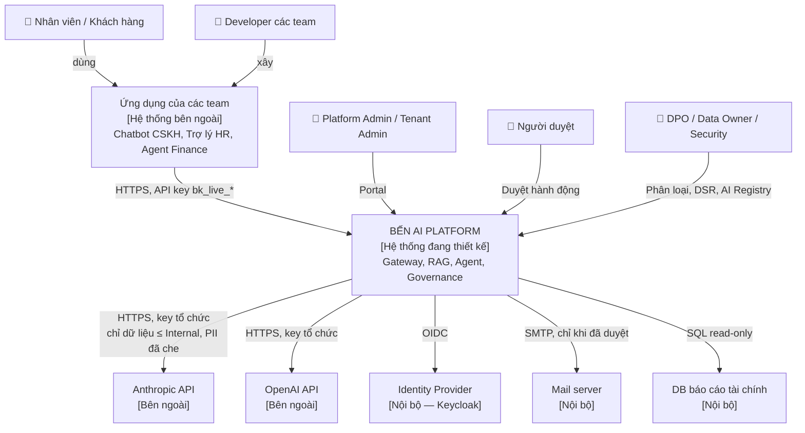

# C4 cấp 1 — System Context

Bến AI Platform nhìn từ ngoài vào: ai dùng, hệ thống nào nó phụ thuộc.

## Danh mục phần tử

| Phần tử | Loại | Trách nhiệm | Quan hệ với Bến |
|---|---|---|---|
| Nhân viên / Khách hàng | Người | Dùng app của tenant | Không trực tiếp; `user_ref` đi qua app |
| Developer | Người | Tích hợp app với Bến | API key, SDK OpenAI/Anthropic |
| Platform Admin / Tenant Admin | Người | Vận hành nền tảng / tenant | Portal |
| Người duyệt | Người | Duyệt tool `write`/`external` | Portal |
| DPO / Data Owner / Security | Người | Governance, audit | Portal, OpenMetadata |
| Ứng dụng của các team | Hệ thống ngoài | Nghiệp vụ của từng team | Client duy nhất của data plane |
| Anthropic API, OpenAI API | Hệ thống ngoài | Suy luận model | Chỉ gateway gọi; chịu ràng buộc residency và PII |
| Identity Provider | Hệ thống nội bộ | Đăng nhập, nhóm phòng ban | Nguồn nhóm cho ACL và RBAC |
| Mail server | Hệ thống nội bộ | Gửi email | Chỉ qua tool `send_email` sau khi duyệt |
| DB báo cáo tài chính | Hệ thống nội bộ | Dữ liệu doanh thu | Chỉ qua tool `sql_query`, user read-only |

## Ranh giới tin cậy

| Ranh giới | Bên trong | Bên ngoài | Kiểm soát chính |
|---|---|---|---|
| B1 — Internet ↔ doanh nghiệp | Mọi thứ trừ provider | Anthropic, OpenAI | Chỉ gateway có egress; PII đã che; residency |
| B2 — App tenant ↔ Bến | Bến | App tenant | API key theo tenant, quota, không tin header tự khai |
| B3 — Người dùng Portal ↔ Bến | Bến | Trình duyệt | OIDC, RBAC theo role Keycloak |
| B4 — Bến ↔ hệ thống nội bộ | Bến | Mail, DB tài chính | Tool đã duyệt, quyền tối thiểu, người duyệt |

Chi tiết mối đe doạ theo ranh giới: [threat-model.md](../threat-model.md).
