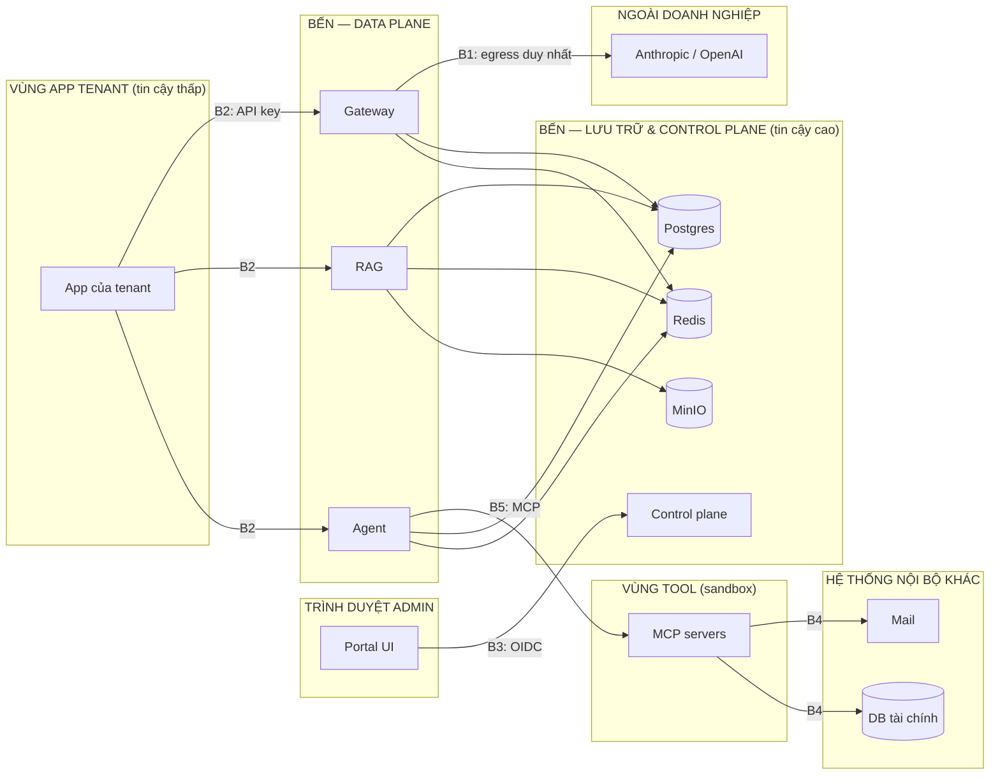

# Threat model — sơ bộ

| | |
|---|---|
| Phiên bản | 0.1 — 14/09/2026 (tuần 1) |
| Phương pháp | STRIDE theo phần tử và ranh giới tin cậy; đối chiếu OWASP Top 10 for LLM Applications (PROJECT.md §15.1) |
| Cập nhật tiếp | Tuần 5 (guardrail), tuần 8 (agent/MCP), tuần 11 (governance), tuần 15 (bản cuối) |

## 1. Tài sản cần bảo vệ

| # | Tài sản | Vì sao quan trọng | Mức |
|---|---|---|---|
| T1 | Key tổ chức của Anthropic/OpenAI | Lộ → bị dùng trái phép, hoá đơn lớn | Rất cao |
| T2 | API key của tenant | Lộ → dùng quota, đọc dữ liệu RAG của tenant | Cao |
| T3 | Dữ liệu cá nhân trong prompt, tài liệu, trace | Nghĩa vụ pháp lý, uy tín | Rất cao |
| T4 | Tài liệu Confidential/Restricted | Bí mật kinh doanh | Rất cao |
| T5 | Policy, prompt, model catalog | Sửa trái phép → vượt kiểm soát | Cao |
| T6 | Audit log, decision log | Bằng chứng tuân thủ | Cao |
| T7 | Quyền hành động của agent (email, ghi file, SQL) | Hành động ra ngoài không mong muốn | Cao |
| T8 | Tính sẵn sàng của gateway | Mọi app AI của công ty phụ thuộc | Cao |

## 2. Ranh giới tin cậy

| Ranh giới | Mô tả | Giả định tin cậy |
|---|---|---|
| B1 | Bến → provider cloud | Provider tuân thủ hợp đồng; kênh HTTPS; **không** tin provider với dữ liệu ≥ Confidential |
| B2 | App tenant → Bến | App có thể lỗi hoặc bị chiếm; mọi input là không đáng tin |
| B3 | Trình duyệt admin → Portal/Control plane | Người dùng đã xác thực OIDC nhưng có thể bị phishing; kiểm tra role mọi API |
| B4 | MCP server → hệ thống nội bộ | Tool chạy với quyền tối thiểu; output tool không đáng tin |
| B5 | Agent → MCP server | Tham số do model sinh ra — không đáng tin |

## 3. STRIDE theo phần tử

### 3.1 AI Gateway

| STRIDE | Mối đe doạ | Kiểm soát dự kiến | Tuần |
|---|---|---|:-:|
| S | Dùng key tenant bị lộ; giả mạo tenant qua header | Key ngẫu nhiên 256 bit, chỉ lưu hash, thu hồi < 60 s; tenant chỉ suy ra từ key | 3 |
| T | App gửi nhãn context giả để lách policy | Chỉ nhận nhãn từ dịch vụ nội bộ có token dịch vụ | 11 |
| R | Tenant chối đã gửi request tốn kém | `usage_events` + trace theo `key_id`, `trace_id` | 4 |
| I | PII ra provider; PII trong log/trace; lỗi trả về lộ DSN | Guard che PII; không log prompt thô; lỗi không chứa chi tiết nội bộ (đã có ở `/readyz` tuần 2) | 2, 5 |
| D | Một tenant làm cạn quota provider chung; request lớn làm nghẽn | RPM/TPM theo tenant, `max_tokens_cap`, timeout, bulkhead theo provider | 4 |
| E | Dùng key tenant gọi API quản trị | API quản trị chỉ nhận JWT có role, không nhận API key | 10 |

### 3.2 RAG Service & Ingest Worker

| STRIDE | Mối đe doạ | Kiểm soát dự kiến | Tuần |
|---|---|---|:-:|
| S | Người dùng giả nhóm quyền trong request | Nhóm lấy từ JWT Keycloak đã xác minh chữ ký, không từ body | 6 |
| T | Tài liệu chứa prompt injection gián tiếp | Quét lúc ingest và truy vấn, quarantine, bọc delimiter | 6 |
| I | Rò rỉ chunk ngoài quyền; rò rỉ giữa tenant | ACL trong `WHERE`; RLS `app.tenant_id` (schema đã bật tuần 2) | 2, 6 |
| D | File cực lớn/độc (zip bomb, PDF hỏng) làm treo worker | Giới hạn kích thước, timeout parse, worker cách ly | 6 |
| E | Parser có lỗ hổng thực thi mã | Worker chạy user không phải root, không có quyền mạng ra ngoài | 6 |

### 3.3 Agent Runtime & MCP servers

| STRIDE | Mối đe doạ | Kiểm soát dự kiến | Tuần |
|---|---|---|:-:|
| T | Output tool chứa injection điều khiển agent | Coi output tool là không đáng tin, quét injection | 8 |
| R | Không rõ ai cho phép email được gửi | Bảng `approvals` ghi người duyệt, thời điểm, lý do; audit | 8 |
| I | `sql_query` đọc cột nhạy cảm; báo cáo gửi ra ngoài chứa dữ liệu mật | DB user read-only trên schema `reporting`; nhãn cột; tool `send_email` max Internal | 8, 11 |
| D | Agent lặp vô hạn, đốt chi phí | `max_steps`, `max_cost_usd`, loop guard | 8 |
| E | Model sinh SQL ghi/xoá; tool vượt sandbox | User DB chỉ SELECT, chặn nhiều statement; container không mạng ngoài | 8 |

### 3.4 Control plane, Portal, Keycloak

| STRIDE | Mối đe doạ | Kiểm soát dự kiến | Tuần |
|---|---|---|:-:|
| S | Chiếm tài khoản admin | OIDC, mật khẩu mạnh; MFA ở môi trường thật (ngoài phạm vi demo) | 10 |
| T | Sửa policy/prompt không qua review | Policy là file trong repo, qua PR + eval; mọi thay đổi qua API ghi audit | 9–10 |
| R | Chối đã đổi policy, hạ nhãn | `audit_logs` chỉ ghi thêm — `ben_app` bị thu hồi UPDATE/DELETE (có test tuần 2) | 2 |
| E | Tenant Admin thao tác tenant khác | Kiểm tra `tenant` claim trên mọi endpoint; test RBAC | 10 |

### 3.5 Lưu trữ (Postgres, Redis, MinIO)

| STRIDE | Mối đe doạ | Kiểm soát dự kiến | Tuần |
|---|---|---|:-:|
| I | Truy cập trực tiếp DB/Redis/MinIO từ ngoài máy | Chỉ bind 127.0.0.1 ở dev; Redis có mật khẩu; mật khẩu sinh ngẫu nhiên (`init_env.py`) | 2 |
| T | Ứng dụng bị chiếm sửa audit | Role `ben_app` tách khỏi owner `ben` | 2 |
| D | Redis đầy bộ nhớ làm hỏng quota và stream | `noeviction` + TTL cache + giới hạn độ dài stream; cảnh báo bộ nhớ | 4, 9 |

## 4. Rủi ro ưu tiên

Khả năng (K) và tác động (T) thang 1–3; điểm = K × T.

| # | Rủi ro | K | T | Điểm | Kiểm soát chính | Tuần | Trạng thái |
|---|---|:-:|:-:|:-:|---|:-:|---|
| R1 | Prompt injection gián tiếp qua tài liệu/tool khiến agent hành động sai | 3 | 3 | 9 | Quét, quarantine, người duyệt tool external | 6, 8 | Mở |
| R2 | PII lọt ra provider do recognizer tiếng Việt bỏ sót | 3 | 3 | 9 | Bộ test 500 mẫu, đo recall, `mask`/`block` cho tenant nhạy cảm | 5 | Mở |
| R3 | Rò rỉ chunk giữa nhóm quyền | 2 | 3 | 6 | ACL trong SQL + RLS + test tự động | 2, 6 | Một phần (RLS đã có) |
| R4 | Lộ key tổ chức của provider | 2 | 3 | 6 | Chỉ gateway giữ; secret store; chặn egress | 3, 10 | Mở |
| R5 | Agent gửi dữ liệu mật ra ngoài | 2 | 3 | 6 | Duyệt `send_email`, nhãn tool, OPA | 8, 11 | Mở |
| R6 | Một tenant làm cạn tài nguyên chung | 3 | 2 | 6 | Quota, bulkhead, circuit breaker | 4 | Mở |
| R7 | Sửa audit log để che dấu vết | 1 | 3 | 3 | Role tách, thu hồi quyền, test | 2 | Đã kiểm soát |
| R8 | Dịch vụ dev bị truy cập từ mạng LAN | 2 | 2 | 4 | Bind 127.0.0.1, mật khẩu ngẫu nhiên | 2 | Đã kiểm soát |

## 5. Câu hỏi mở

- Token dịch vụ nội bộ (RAG/agent → gateway) dùng client credentials của Keycloak hay mTLS? Chốt ở tuần 6.
- Langfuse lưu nội dung prompt đã che: có cần mã hoá thêm ở tầng ứng dụng không? Chốt ở tuần 9.
- MCP server xác thực với agent runtime thế nào? Chốt ở tuần 8.
